<a id="top"></a>


<div align="center">


<br/>


**A planned, controlled DNS C2-pattern investigation using harmless synthetic data, structure/frequency analytics, raw-evidence validation and human-approved response.**

[🏗️ Infrastructure](https://github.com/DNSentinel-Lab/DNS-Lab-Infrastructure) · [🔎 Scenario 01](https://github.com/DNSentinel-Lab/Scenario-01-DNS-Recon) · [🧬 Scenario 02](https://github.com/DNSentinel-Lab/Scenario-02-DGA) · [🔄 Scenario 03](https://github.com/DNSentinel-Lab/Scenario-03-Fast-Flux) · [**🛰️ Scenario 04**](https://github.com/DNSentinel-Lab/Scenario-04-DNS-Tunneling)

</div>


## 🎯 Mission Brief

| Field | Scenario record |
|---|---|
| **Mission** | Generate harmless synthetic tunneling-like DNS labels/queries and determine whether the SOC can detect the structure and frequency using DNS plus client/network context |
| **Status** | ⚪ Planned — design ready; execution has not started |
| **MITRE ATT&CK** | `T1071.004 — Application Layer Protocol: DNS`; `T1572` only where implemented behavior actually fits |
| **Cyber Kill Chain** | Command & Control |
| **Core DNS evidence** | Label structure, query length, query type, parent domain, unique subdomains and frequency |
| **Safety boundary** | Synthetic, non-sensitive data only |
| **Response** | Human-approved isolation/restriction or resolver sinkhole, with before/after verification |

### What this scenario is designed to prove

The goal is to detect tunneling-like DNS behavior without over-mapping or treating every long/encoded-looking label as malicious. The final conclusion must come from raw DNS evidence and available endpoint/network context, not from an AI verdict.


## 🏗️ Scenario Architecture

```mermaid
%%{init: {
  "themeVariables": {
    "fontSize": "22px"
  },
  "flowchart": {
    "nodeSpacing": 35,
    "rankSpacing": 45
  }
}}%%

flowchart LR

    %% =====================================================
    %% 1 — SOURCE + DNS
    %% =====================================================
    subgraph S1[" "]
        direction TB

        H1["💻 1 · SOURCE + DNS"]

        V["🧑 Victim"]
        L["🏷️ Synthetic<br/>DNS Labels"]
        R["🛡️ Defender DNS<br/>Resolver"]
        D["🌍 tunnel.soclab..."]

        H1 --> V --> L --> R --> D
    end


    %% =====================================================
    %% 2 — TELEMETRY + ANALYSIS
    %% =====================================================
    subgraph S2[" "]
        direction TB

        H2["📡 2 · TELEMETRY + ANALYSIS"]

        SPL["🟢 Splunk Enterprise"]

        PAT["🧬 Pattern Analysis<br/>Length · Structure<br/>Frequency · Query Type"]

        subgraph ANALYSIS[" "]
            direction LR

            AI["🤖 AI<br/>Assistance"]

            SOC["🔎 Human SOC<br/>Investigation"]
        end

        H2 --> SPL --> PAT

        PAT --> AI
        PAT --> SOC
        AI --> SOC
    end


    %% =====================================================
    %% 3 — HUMAN RESPONSE
    %% =====================================================
    subgraph S3[" "]
        direction TB

        H3["🛡️ 3 · HUMAN RESPONSE"]

        IR["👤 Human IR<br/>Decision"]

        ACT["🎯 Block / Sinkhole<br/>at Defender Resolver"]

        VERIFY["✅ Post-Response<br/>Verification Evidence"]

        H3 --> IR --> ACT --> VERIFY
    end


    %% =====================================================
    %% MAIN HORIZONTAL FLOW
    %% =====================================================
    R --> SPL
    SOC --> IR

    %% Verification returns to Splunk.
    %% Response target is stated inside ACT,
    %% avoiding a huge backward arrow to the resolver.
    VERIFY -.-> SPL


    %% =====================================================
    %% HEADER STYLES — LARGE
    %% =====================================================
    classDef h1 fill:#172554,stroke:#60a5fa,stroke-width:3px,color:#ffffff,font-size:24px,font-weight:bold;
    classDef h2 fill:#312e81,stroke:#a78bfa,stroke-width:3px,color:#ffffff,font-size:24px,font-weight:bold;
    classDef h3 fill:#450a0a,stroke:#f87171,stroke-width:3px,color:#ffffff,font-size:24px,font-weight:bold;

    class H1 h1;
    class H2 h2;
    class H3 h3;


    %% =====================================================
    %% NODE STYLES — LARGE
    %% =====================================================
    classDef source fill:#172554,stroke:#60a5fa,stroke-width:2px,color:#ffffff,font-size:22px;
    classDef labels fill:#1f2937,stroke:#94a3b8,stroke-width:2px,color:#ffffff,font-size:22px;
    classDef resolver fill:#083344,stroke:#22d3ee,stroke-width:3px,color:#ffffff,font-size:22px;
    classDef domain fill:#3b0764,stroke:#c084fc,stroke-width:2px,color:#ffffff,font-size:22px;

    classDef splunk fill:#052e16,stroke:#4ade80,stroke-width:3px,color:#ffffff,font-size:22px;
    classDef pattern fill:#422006,stroke:#fbbf24,stroke-width:2px,color:#ffffff,font-size:22px;
    classDef ai fill:#581c87,stroke:#e879f9,stroke-width:2px,color:#ffffff,font-size:22px;
    classDef soc fill:#164e63,stroke:#38bdf8,stroke-width:3px,color:#ffffff,font-size:22px;

    classDef ir fill:#7f1d1d,stroke:#fb7185,stroke-width:3px,color:#ffffff,font-size:22px;
    classDef action fill:#713f12,stroke:#fb923c,stroke-width:3px,color:#ffffff,font-size:22px;
    classDef verify fill:#052e16,stroke:#4ade80,stroke-width:3px,color:#ffffff,font-size:22px;

    class V source;
    class L labels;
    class R resolver;
    class D domain;

    class SPL splunk;
    class PAT pattern;
    class AI ai;
    class SOC soc;

    class IR ir;
    class ACT action;
    class VERIFY verify;


    %% =====================================================
    %% CONTAINERS
    %% =====================================================
    style S1 fill:#0d1117,stroke:#60a5fa,stroke-width:1px
    style S2 fill:#0d1117,stroke:#a78bfa,stroke-width:1px
    style S3 fill:#0d1117,stroke:#f87171,stroke-width:1px
    style ANALYSIS fill:#111827,stroke:#30363d,stroke-width:1px


    %% =====================================================
    %% EDGES
    %% =====================================================
    linkStyle default stroke:#b6c2d1,stroke-width:3px
```



> The scenario stays inside the controlled namespace and uses only harmless synthetic data. T1572 is not claimed unless the implemented behavior supports it.


## 🔄 SOC Lifecycle & Implementation Reality

| Stage | State |
|---|---|
| **Design** | ✅ |
| **Infrastructure Reuse** | 🟡 |
| **Baseline** | ⚪ |
| **Simulate** | ⚪ |
| **Detect** | ⚪ |
| **SOC/IR** | ⚪ |
| **Verify** | ⚪ |
| **Document** | 🟡 |

> [!IMPORTANT]
> ✅ means supported by implemented project evidence. 🟡 means design/infrastructure/documentation exists but the scenario stage is not complete. ⚪ means planned and is **not presented as implemented**.


## 🎯 Objective

Generate only harmless synthetic data inside DNS labels/queries and determine whether the SOC can identify tunneling-like structure and frequency using DNS, endpoint/client and network context.

## 🏗️ Infrastructure Dependency

Reuse the Scenario 02 resolver, victim and sinkhole. Use the controlled `tunnel.soclab.abdul4rehman215.tech` namespace. Add a separate team-controlled authoritative DNS endpoint only if the final scenario requires genuine authoritative request/response behavior that cannot be demonstrated through the existing controlled path.

The shared AWS/Splunk platform is not rebuilt inside this repository. Any new AWS resource is designed in the infrastructure project and documented there after it exists.

## 🔎 Detection Focus

- long or encoded-looking DNS labels;
- query length/label structure and frequency;
- TXT/A or other query-type behavior actually generated;
- unique subdomains beneath the controlled parent;
- repeated client/process behavior;
- pre- and post-containment network/DNS evidence;

## 🌐 Network & Protocol View

- Layer 7 DNS: label structure, query type, parent domain and response behavior;
- Layer 4: UDP/TCP 53 and any controlled follow-up path;
- Layer 3: client/resolver/destination context where useful;
- Endpoint: victim/process context if collected;
- Containment: defender resolver block/sinkhole and verification;

DNS is Layer 7 evidence, but the scenario should correlate it with the Layer 3/4, endpoint, cloud or application evidence that actually helps prove the behavior.

## 📊 Planned Dashboard

The dashboard should follow one shared time range and lead the analyst from summary → behavior → correlation → raw evidence.

- Shared time range plus client, parent-domain, query-type and response filters;
- KPIs: total queries, unique subdomains, long-label count, query-type mix, active clients;
- Query frequency and label-length distribution over time;
- Top parent/subdomain patterns and TXT/A behavior;
- Client/process and network correlation where available;
- Clear pre-containment versus post-containment result;

See [`dashboard/README.md`](dashboard/README.md) for the planned layout.

## 👥 Team

| Role | Member |
|---|---|
| Project Lead / Attack Simulation | Lubaba |
| SOC Analyst | Abdul-Rehman |
| Detection Engineer | Musfira |
| IR / Defender | Sonia |

## 🔄 Scenario Workflow

This repository follows the common 20-part standard:

**Objective → Architecture → Prerequisites → Simulation → Telemetry → Detection → SPL → Alert → AI Triage → SOC Analysis → IR → Evidence → Containment → Verification → Results → MITRE → False Positives → Lessons → Reproduction → Screenshots.**

The working checklist is [`SCENARIO-RUNBOOK.md`](SCENARIO-RUNBOOK.md).

## 🗂️ Repository Navigation

```text
.
├── README.md                 # scenario overview and locked design
├── SCENARIO-RUNBOOK.md       # 20-part execution/documentation checklist
├── dashboard/                # dashboard plan, later final XML/export
├── spl/                      # baseline, hunting, detection and validation SPL
├── ai/                       # scenario profile/payload mapping for shared AI bridge
├── ir/                       # response/containment/verification record
├── evidence/                 # structured ground truth and evidence notes
└── screenshots/              # curated visual evidence
```

The folders are prepared now, but fake implementation artifacts are not. Real `.spl`, dashboard XML, AI profiles and evidence are added only when they have been built and tested.

## 🔗 Shared Project References

- [DNS Lab Infrastructure](https://github.com/DNSentinel-Lab/DNS-Lab-Infrastructure) — shared AWS, DNS, Splunk and AI foundation
- [Scenario infrastructure roadmap](https://github.com/DNSentinel-Lab/DNS-Lab-Infrastructure/blob/main/00-project-design/scenario-infrastructure-roadmap.md) — future EC2/DNS/network changes owned by the infrastructure repository
- [Scenario documentation standard](https://github.com/DNSentinel-Lab/DNS-Lab-Infrastructure/blob/main/00-project-design/scenario-documentation-standard.md) — common 20-part SOC workflow, dashboard and evidence rules

## ✅ Completion Condition

Detection is tuned against benign long/encoded DNS patterns, the SOC validates AI assistance against raw events, containment is approved by a human, and the final before/after evidence proves the controlled behavior no longer follows its original path.


## 🧠 Security Engineering Skills in Scope

| Skill area | Scenario evidence / design focus |
|---|---|
| **DNS Analysis** | Label structure, query length, parent domain, unique subdomains and query types |
| **Detection Engineering** | Frequency/structure-based behavior with deliberate false-positive testing |
| **Endpoint / Network Context** | Client/process and L3/L4 context where available |
| **MITRE Discipline** | T1071.004 primary; T1572 only when implemented behavior supports it |
| **Incident Response** | Human-approved isolation/restriction or DNS sinkhole with verification |
| **AI-Assisted SOC** | AI remains advisory and must be validated against raw evidence |


## 📚 Documentation Model

This scenario repository is a **case/execution layer** built on the shared [DNS Lab Infrastructure](https://github.com/DNSentinel-Lab/DNS-Lab-Infrastructure). It intentionally separates:

- **Design / prerequisites** — what must exist before the exercise;
- **Simulation / ground truth** — what the authorized operator actually generated;
- **Detection Engineering** — baseline, hunting, tuned detection and validation;
- **SOC investigation** — defender-visible evidence and human disposition;
- **IR / containment** — independently justified response and verification;
- **Evidence** — screenshots and structured artifacts that prove the final claims.

> [!NOTE]
> Planned work stays labelled as planned. This repository does not create fake screenshots, fake SPL results, fake ML metrics or fake incident outcomes to make a scenario look complete.

<div align="center">

### DNSentinel Lab
**Build the telemetry. Prove the detection. Investigate the evidence. Verify the response.**

[🏗️ Infrastructure](https://github.com/DNSentinel-Lab/DNS-Lab-Infrastructure) · [🔎 Scenario 01](https://github.com/DNSentinel-Lab/Scenario-01-DNS-Recon) · [🧬 Scenario 02](https://github.com/DNSentinel-Lab/Scenario-02-DGA) · [🔄 Scenario 03](https://github.com/DNSentinel-Lab/Scenario-03-Fast-Flux) · [**🛰️ Scenario 04**](https://github.com/DNSentinel-Lab/Scenario-04-DNS-Tunneling)

[⬆ Back to top](#top)

</div>


