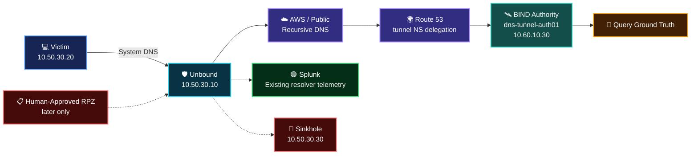

<a id="top"></a>


<div align="center">


<br/>


**A controlled DNS tunneling-pattern case file using synthetic, non-sensitive data over a real defender resolver and a team-controlled public authoritative DNS path.**

[🏗️ Infrastructure](https://github.com/DNSentinel-Lab/DNS-Lab-Infrastructure) · [🔎 Scenario 01](https://github.com/DNSentinel-Lab/Scenario-01-DNS-Recon) · [🧬 Scenario 02](https://github.com/DNSentinel-Lab/Scenario-02-DGA) · [🔄 Scenario 03](https://github.com/DNSentinel-Lab/Scenario-03-Fast-Flux) · [**🛰️ Scenario 04**](https://github.com/DNSentinel-Lab/Scenario-04-DNS-Tunneling)

</div>


## 🎯 Mission Brief

| Field | Scenario record |
|---|---|
| **Mission** | Generate harmless synthetic tunneling-like DNS labels/queries and determine whether the SOC can detect structure, uniqueness and timing using real resolver telemetry |
| **Current status** | 🟢 Infrastructure Ready — Detection Engineering next; official exercise not started |
| **Primary MITRE ATT&CK** | `T1071.004 — Application Layer Protocol: DNS` |
| **Conditional mapping** | `T1572` is not claimed unless a later implementation genuinely encapsulates another protocol |
| **Cyber Kill Chain** | Command & Control context |
| **Core DNS evidence** | Label/qname length, unique children, parent concentration, frequency/inter-arrival, query type, client and rcode |
| **Safety boundary** | Synthetic, non-sensitive test data only; project-owned/authorized infrastructure |
| **Response path** | Human-approved Unbound RPZ / sinkhole only after SOC → IR validation |

> **Core question:** can the team distinguish tunneling-like DNS structure from ordinary DNS noise, investigate it without inventing attribution, and prove a proportionate response changed the observed network outcome?


## 🚦 Current Workstream State

| Workstream | Status | Owner |
|---|---|---|
| Scenario 04 infrastructure engineering | ✅ Complete | **Lubaba** |
| Detection Engineering / Dashboard / Alert / Scenario AI | ⏳ Next | **Abdul-Rehman** |
| Official simulation / operator ground truth | ⏳ Pending | **Sonia** |
| SOC investigation / threat hunt | ⏳ Pending | **Lubaba** |
| IR validation / response decision | ⏳ Pending | **Musfira** |
| RPZ/sinkhole verification | ⏳ Pending — only if justified by IR | Musfira + shared defender infrastructure |
| Final ground-truth comparison / closeout | ⏳ Pending | Team |

The infrastructure implementation credit is separate from the rotating official exercise role. **Lubaba built the Scenario 04 infrastructure extension; Sonia remains the current canonical Project Lead / Simulation owner for the later official run.**


## 🏗️ What Is Actually Built

Scenario 04 reuses the Scenario 02 defender platform:

```text
dns-soc-victim01     10.50.30.20   controlled client
dns-soc-resolver01   10.50.30.10   Unbound defender resolver
dns-soc-sinkhole01   10.50.30.30   reusable private sinkhole
dns-soc-splunk01     10.50.20.10   Splunk Enterprise + shared AI bridge
```

One scenario-specific host was added:

```text
dns-tunnel-auth01    10.60.10.30
Ubuntu 24.04 / BIND 9 authoritative-only
Zone: tunnel.soclab.abdul4rehman215.tech
```

The shared infrastructure repository contains the full implementation, commands, configuration and curated screenshots:

**[Scenario 04 DNS Tunneling Infrastructure →](https://github.com/DNSentinel-Lab/DNS-Lab-Infrastructure/blob/main/02-aws-build/10-scenario-04-dns-tunneling.md)**

This scenario repository intentionally does **not duplicate the infrastructure screenshot set**.

## 🌐 Proven DNS Path



Infrastructure validation proved:

- BIND is authoritative-only and recursion is disabled;
- wildcard child labels receive authoritative answers;
- BIND query logging records the received qname;
- Route 53 delegates `tunnel.soclab...` to the controlled authority;
- the victim still uses `10.50.30.10` as its normal DNS server;
- Unbound records the original victim `10.50.30.20`;
- the authoritative server receives the same fresh qname;
- three fresh unique subdomains crossed the complete path.

### Attribution boundary

The two DNS views answer different questions:

```text
Unbound log  -> Which lab client made the query?
BIND log     -> Did the delegated authoritative endpoint receive the qname?
```

The public BIND server sees upstream recursive-resolver addresses, not the private victim address. That distinction must be preserved during the SOC investigation.


## ⚠️ Operational Constraint Before Execution

`dns-tunnel-auth01` used public IPv4 `98.93.89.38` during infrastructure validation, but that address is **not an Elastic IP**. The account had already reached its regional Elastic-IP quota.

Before any official run:

1. confirm the EC2 public IPv4 has not changed;
2. if it changed, update Route 53 `ns1.tunnel`;
3. update the BIND zone A records and SOA serial;
4. validate/restart BIND;
5. repeat public and victim smoke tests.

This is a deployment constraint, not a detection result.


## 🧠 Detection Engineering — Next Phase

The next owner is **Abdul-Rehman**. Detection work begins with real data, not with a copied threshold.

The planned order is:

```text
Telemetry pre-flight
    ↓
Normal DNS baseline
    ↓
Feature extraction
    ↓
Threshold-free hunting
    ↓
Small controlled engineering positive
    ↓
Benign lookalike tests
    ↓
Detection v1.0
    ↓
Dashboard + scheduled alert
    ↓
Scenario AI profile
    ↓
Validation / freeze
    ↓
Official exercise
```

The detailed engineering checklist is in [`DETECTION-ENGINEERING-PLAN.md`](DETECTION-ENGINEERING-PLAN.md).

### Detection dimensions

The final search should combine several signals rather than treating one long hostname as malicious:

- full qname length;
- longest/first-label length;
- label count and character mix;
- optional entropy/randomness feature;
- query count and queries/minute;
- unique qnames / unique child labels;
- concentration under the same parent domain;
- inter-arrival timing;
- qtype diversity or unusual query types actually generated;
- client identity and response code.

Final thresholds are **not frozen yet**. They must come from the baseline, controlled positive and benign lookalike tests.


## 🎬 Official Execution — Still Pending

Once Detection v1.0 is frozen, the information-separated exercise follows:

```text
Sonia — controlled simulation + private ground truth
        ↓
Frozen Detection v1.0
        ↓
Shared AI assistance
        ↓
Lubaba — independent SOC investigation
        ↓
Evidence-backed SOC → IR handoff
        ↓
Musfira — independent IR validation
        ↓
Human response decision
        ↓
RPZ/sinkhole only if justified
        ↓
Before/after verification
        ↓
Safe reset
        ↓
Ground-truth reveal + final comparison
```

The full operating checklist is maintained in [`SCENARIO-RUNBOOK.md`](SCENARIO-RUNBOOK.md).


## 🧪 What We Will — and Will Not — Claim

**We will document:** controlled tunneling-like DNS behavior using synthetic, non-sensitive data over a real resolver/authoritative path.

**We will not claim:**

- malware exfiltration;
- endpoint compromise;
- malicious C2 attribution without evidence;
- `T1572` without an implementation that genuinely supports it;
- successful containment before the IR phase actually performs and verifies it;
- a completed Scenario 04 while only infrastructure/detection work exists.

If a tiny decoder/reassembly utility is later built to reconstruct the synthetic test message from received labels, it will be documented as **simulation tooling**. It does not exist yet.


## 🗂️ Repository Guide

| Area | Purpose | Current state |
|---|---|---|
| [`SCENARIO-RUNBOOK.md`](SCENARIO-RUNBOOK.md) | Full scenario operating sequence | Infrastructure gate updated; execution pending |
| [`DETECTION-ENGINEERING-PLAN.md`](DETECTION-ENGINEERING-PLAN.md) | Next-phase engineering checklist | Ready |
| [`spl/`](spl/) | Baseline, hunting, detection and validation SPL | Awaiting real engineering work |
| [`dashboard/`](dashboard/) | Analyst dashboard / exported artifact | Awaiting stable fields |
| [`ai/`](ai/) | Scenario-specific AI payload/profile | Awaiting frozen detection fields |
| [`evidence/`](evidence/) | Structured official scenario evidence | Reserved for later phases |
| [`screenshots/`](screenshots/) | Scenario-execution screenshots | Reserved; infrastructure screenshots stay in shared repo |
| [`ir/`](ir/) | IR decision, containment, verification and reset | Awaiting official exercise |


## 👥 Current Canonical Roles

| Role | Owner |
|---|---|
| 🎯 Project Lead / Simulation | [Sonia](https://github.com/sonia11mansha415) |
| 🔍 SOC Analyst / Threat Hunter | [Lubaba](https://github.com/lubaba1513-pixel) |
| 🛠️ Detection Engineer / AI Integrator | [Abdul-Rehman](https://github.com/abdul4rehman215) |
| 🛡️ Incident Responder / Defender | [Musfira](https://github.com/MUSFIRA-ZAFAR) |

> **Infrastructure implementation credit:** Lubaba prepared the Scenario 04 AWS/BIND/Route 53 infrastructure before the rotating official exercise begins.


<div align="center">

### **Infrastructure is ready. Detection comes next. Evidence still owns the verdict.**

[🏗️ Infrastructure](https://github.com/DNSentinel-Lab/DNS-Lab-Infrastructure) · [🔎 Scenario 01](https://github.com/DNSentinel-Lab/Scenario-01-DNS-Recon) · [🧬 Scenario 02](https://github.com/DNSentinel-Lab/Scenario-02-DGA) · [🔄 Scenario 03](https://github.com/DNSentinel-Lab/Scenario-03-Fast-Flux) · [⬆ Back to top](#top)

</div>


