<a id="top"></a>


<div align="center">


<br/>


<br/>

[🎬 Execution](SCENARIO-04-EXECUTION.md) · [📘 Runbook](SCENARIO-RUNBOOK.md) · [🧠 Detection](detection-engineering/README.md) · [📊 Dashboard](dashboard/README.md) · [🤖 AI](ai/README.md) · [🎯 Operator](attacker/README.md) · [🔎 SOC](soc/README.md) · [🛡️ IR](ir/README.md) · [🧾 Evidence](evidence/README.md)

[🏗️ Infrastructure](https://github.com/DNSentinel-Lab/DNS-Lab-Infrastructure) · [🔎 Scenario 01](https://github.com/DNSentinel-Lab/Scenario-01-DNS-Recon) · [🧬 Scenario 02](https://github.com/DNSentinel-Lab/Scenario-02-DGA) · [🔄 Scenario 03](https://github.com/DNSentinel-Lab/Scenario-03-Fast-Flux) · [**🛰️ Scenario 04**](https://github.com/DNSentinel-Lab/Scenario-04-DNS-Tunneling)

**A completed, evidence-backed DNS tunneling case: real DNS transport, frozen detection, independent SOC investigation, human-validated AI assistance, independently validated IR, scoped RPZ containment, troubleshooting, verification and safe reset.**

</div>


## 🎯 Mission Brief

Scenario 04 asks a practical defender question:

> **Can defenders identify a short burst of fresh, encoded-looking DNS child labels, distinguish it from legitimate long DNS names, investigate it without operator ground truth, and prove a proportionate DNS-layer response without overstating attribution?**

| Field | Final scenario record |
|---|---|
| **Scenario** | DNS Tunneling |
| **Primary MITRE ATT&CK** | `T1071.004 — Application Layer Protocol: DNS` |
| **Cyber Kill Chain context** | Command & Control |
| **T1572** | Not claimed |
| **Victim / resolver-visible client** | `dns-soc-victim01 / 10.50.30.20` |
| **Defender resolver** | `dns-soc-resolver01 / 10.50.30.10` |
| **Controlled namespace** | `tunnel.soclab.abdul4rehman215.tech` |
| **Authoritative endpoint** | `dns-tunnel-auth01 / 10.60.10.30` |
| **Reusable sinkhole** | `dns-soc-sinkhole01 / 10.50.30.30` |
| **Final scenario state** | ✅ **Complete / evidence-backed closeout** |

### 👥 Four Roles · One Connected Case

| Role | Owner | Final outcome |
|---|---|---|
| 🎯 Project Lead / Private Exercise Operator | **Sonia** | ✅ Official finite execution complete |
| 🧠 Detection Engineer / AI Integrator | **Abdul-Rehman** | ✅ Detection v1.0 + Dashboard + Alert + AI frozen |
| 🔎 SOC Analyst / Threat Hunter | **Lubaba** | ✅ `INCONCLUSIVE — ESCALATION WARRANTED` |
| 🛡️ Incident Responder / Defender | **Musfira** | ✅ Independent validation + RPZ containment + safe reset |

> **Scenario infrastructure preparation support:** **Lubaba** — complete.

> [!NOTE]
> The exercise used real project-owned DNS infrastructure and real defender telemetry, but it did **not** claim a real-world compromise, malware infection, confidential-data exfiltration, or attacker attribution. The realism comes from real protocol behavior, information separation, frozen controls, independent decisions, and verified response.


## 🌐 End-to-End Case Flow

```mermaid
%%{init: {
  "theme": "base",
  "themeVariables": {
    "background": "#030712",
    "primaryTextColor": "#ffffff",
    "lineColor": "#f8fafc",
    "fontSize": "28px",
    "edgeLabelBackground": "#111827"
  },
  "flowchart": {
    "nodeSpacing": 40,
    "rankSpacing": 48,
    "curve": "basis",
    "padding": 18
  }
}}%%

flowchart LR

    %% =====================================================
    %% SAME ORIGINAL STRUCTURE
    %% =====================================================
    V["🖥️ dns-soc-victim01<br/>10.50.30.20"] -->|"A QUERIES"| R["🛡️ dns-soc-resolver01<br/>10.50.30.10 / Unbound"]

    R -->|"RECURSIVE DNS"| P["🌍 Public DNS / Delegation"]

    P --> A["🛰️ dns-tunnel-auth01<br/>BIND Authoritative"]

    R --> S["📊 Splunk<br/>dns_soc_dns"]

    S --> D["🎯 Detection<br/>v1.0"]

    D --> AI["🤖 dns_tunneling_v1"]

    D --> SOC["🔎 Lubaba<br/>SOC"]

    SOC --> IR["🛡️ Musfira<br/>IR"]

    IR -->|"APPROVED RPZ"| H["🕳️ 10.50.30.30<br/>Sinkhole"]


    %% =====================================================
    %% DNS PATH
    %% =====================================================
    classDef victim fill:#172554,stroke:#60a5fa,stroke-width:6px,color:#ffffff,font-size:29px;

    classDef resolver fill:#064e5f,stroke:#22d3ee,stroke-width:7px,color:#ffffff,font-size:29px;

    classDef publicdns fill:#075985,stroke:#38bdf8,stroke-width:6px,color:#ffffff,font-size:29px;

    classDef authoritative fill:#312e81,stroke:#a78bfa,stroke-width:6px,color:#ffffff,font-size:29px;


    %% =====================================================
    %% SPLUNK + DETECTION
    %% =====================================================
    classDef splunk fill:#14532d,stroke:#4ade80,stroke-width:7px,color:#ffffff,font-size:29px;

    classDef detection fill:#065f46,stroke:#86efac,stroke-width:7px,color:#ffffff,font-size:30px;

    classDef ai fill:#581c87,stroke:#e879f9,stroke-width:7px,color:#ffffff,font-size:29px;


    %% =====================================================
    %% HUMAN VALIDATION
    %% =====================================================
    classDef soc fill:#075985,stroke:#38bdf8,stroke-width:7px,color:#ffffff,font-size:29px;

    classDef ir fill:#312e81,stroke:#818cf8,stroke-width:7px,color:#ffffff,font-size:29px;


    %% =====================================================
    %% RESPONSE
    %% =====================================================
    classDef response fill:#78350f,stroke:#fbbf24,stroke-width:8px,color:#ffffff,font-size:30px;


    %% =====================================================
    %% APPLY STYLES
    %% =====================================================
    class V victim;
    class R resolver;
    class P publicdns;
    class A authoritative;

    class S splunk;
    class D detection;
    class AI ai;

    class SOC soc;
    class IR ir;

    class H response;


    %% =====================================================
    %% COLORED CONNECTORS
    %% =====================================================
    linkStyle 0 stroke:#60a5fa,stroke-width:5px;
    linkStyle 1 stroke:#22d3ee,stroke-width:5px;
    linkStyle 2 stroke:#a78bfa,stroke-width:5px;

    linkStyle 3 stroke:#4ade80,stroke-width:5px;
    linkStyle 4 stroke:#86efac,stroke-width:5px;

    linkStyle 5 stroke:#e879f9,stroke-width:5px;
    linkStyle 6 stroke:#38bdf8,stroke-width:5px;
    linkStyle 7 stroke:#818cf8,stroke-width:5px;

    linkStyle 8 stroke:#fbbf24,stroke-width:6px;
```



The exercise kept private operator ground truth separate from the defender investigation until SOC and IR decisions were locked. That separation is what makes the final comparison meaningful.

**[Read the concise end-to-end execution record →](SCENARIO-04-EXECUTION.md)**


## 🏁 Scenario 04 Closeout Snapshot

<table>
<tr>
<td align="center" width="17%"><strong>🛰️ DNS Behavior</strong><br/><sub>7 structured queries</sub></td>
<td align="center" width="17%"><strong>🧠 Detection</strong><br/><sub>v1.0 fired</sub></td>
<td align="center" width="16%"><strong>🤖 AI</strong><br/><sub>Correct · advisory</sub></td>
<td align="center" width="17%"><strong>🔎 SOC</strong><br/><sub>Inconclusive → IR</sub></td>
<td align="center" width="17%"><strong>🛡️ IR</strong><br/><sub>Independently validated</sub></td>
<td align="center" width="16%"><strong>🎯 Response</strong><br/><sub>RPZ → verify → reset</sub></td>
</tr>
</table>

<div align="center">

**7 queries · 7 unique qnames · 7 unique child labels · 7 long labels · max first label 27 · 7/7 NOERROR**

**Encode → Query → Resolve → Detect → Investigate → Contain → Verify → Reset**

</div>

The official resolver-visible burst occurred between **16:37:19.215675 and 16:37:31.370200 UTC** on `2026-09-02`.

| Observation | Final value |
|---|---:|
| DNS queries | **7** |
| Unique qnames | **7** |
| Unique child labels | **7** |
| Long-label count | **7** |
| Maximum first-label length | **27** |
| Query type | **A** |
| Resolver replies | **7 / 7 NOERROR** |
| Official alert | **16:39:01 UTC** |
| AI processed | **16:39:21.727239 UTC** |
| SOC disposition | **INCONCLUSIVE — ESCALATION WARRANTED** |
| SOC confidence | **High** |
| IR exercise result | **AUTHORIZED CONTROLLED EXERCISE ACTIVITY — CONTROLLED CONTAINMENT VALIDATED** |
| RPZ validation | `*.tunnel... → 10.50.30.30` |
| Safe reset | Normal authoritative resolution restored |

The authoritative BIND log independently received the same seven generated names from public recursive resolvers. Its first and last receipt timestamps aligned with the Unbound defender timeline to within milliseconds.

```text
BIND first:    16:37:19.219 UTC
Unbound first: 16:37:19.215675 UTC

BIND last:     16:37:31.375 UTC
Unbound last:  16:37:31.370200 UTC
```

> **The alert was only the midpoint. Scenario 04 closed when the defenders proved the behavior, preserved attribution limits, validated a human-approved DNS-layer response, recovered from a real configuration failure, and restored the resolver to a verified safe state.**


## 🧠 Detection Engineering — Abdul-Rehman

Detection Engineering was completed and frozen **before** the official exercise. Abdul-Rehman moved from trusted resolver telemetry to baseline, explainable feature engineering, hunting, Dashboard Studio, controlled positive/benign testing, scheduled alerting, raw-event drilldown, and the `dns_tunneling_v1` AI evidence contract.

Frozen Detection v1.0:

```text
unique_child_labels >= 5
AND long_label_count >= 5
AND max_first_label_length > 16
```

**[Read Abdul-Rehman's Detection Engineering story →](detection-engineering/DETECTION-ENGINEERING.md)**


## 🧬 Operator Execution — Sonia

Sonia used a finite lab-only client on `dns-soc-victim01`. It Base32-encoded a harmless synthetic training message into **seven DNS-safe child labels** and issued ordinary A lookups through the victim's normal resolver.


*What this proves: the seven unique child labels were generated from the intended victim path rather than from the defender tooling or a Splunk test search.*

The client was executed once during review before the formal execution gate. Instead of rerunning it for a cleaner timeline, Sonia preserved that real one-time session, verified the client had exited, and continued with evidence preservation. That deviation is documented as an operational lesson rather than hidden.

**[Read Sonia's Project Lead / Adversary story →](attacker/PROJECT-LEAD-ADVERSARY.md)**


## 🔎 SOC Investigation — Lubaba

Lubaba worked from defender-visible evidence without private operator timing, payload, generated qname list, or BIND ground truth. She independently reconstructed the one-minute behavior and reproduced every frozen Detection v1.0 condition.

She then challenged the result against measured normal behavior. Legitimate AWS DNS traffic also contained long labels, but no non-Scenario-04 parent reproduced the same **combined** short-window pattern.

The human hypothesis was written **before** AI review. The AI result was then checked claim by claim against raw DNS evidence and rated **CORRECT**, while `human_validation_required=true` remained preserved.

Lubaba's final decision was intentionally cautious:

> **INCONCLUSIVE — ESCALATION WARRANTED**  
> **Confidence: High**

She had strong evidence of DNS tunneling-like structure, but not enough endpoint/process/authorization evidence to claim malware, compromise, payload transfer, exfiltration, or attacker identity.

**[Read Lubaba's SOC investigation →](soc/SOC-ANALYST-INVESTIGATION.md)**


## 🛡️ Incident Response — Musfira

Musfira treated the SOC handoff as claims to validate, not as a verdict to repeat. IR independently reproduced the DNS evidence, checked available telemetry, reviewed VPC flows, narrowed CloudTrail context, and tested recurrence.

A particularly important IR decision came from network correlation. HTTPS flows existed after the DNS burst, but the same destinations were already active **before** it. Musfira therefore rejected a causal claim that the DNS activity produced those HTTPS connections.

After authorization context was established, IR performed a controlled, temporary response validation using the existing Unbound RPZ framework.

```text
*.tunnel.soclab.abdul4rehman215.tech
        ↓
10.50.30.30
```


After evidence capture, Musfira restored the pre-change RPZ state and verified normal authoritative resolution returned.


**[Read Musfira's Incident Response story →](ir/INCIDENT-RESPONSE.md)**


## 📸 Scenario 04 Evidence Highlights

> **Build → Encode → Resolve → Detect → Investigate → Validate → Contain → Verify → Reset**

The strongest visual artifacts are curated here as a **proof layer**. The complete engineering, operator, SOC and IR evidence sets remain in their role-owned folders for technical audit.

### 🧠 Detection Engineering Evidence

<table>
<tr>
<td width="33%" valign="top"><br/><br/><strong>Behavioral feature engineering:</strong> parent/child structure and first-label length were investigated before thresholds were frozen.</td>
<td width="33%" valign="top"><br/><br/><strong>Investigation surface:</strong> Dashboard Studio exposed DNS volume, labels, qtype/rcode, parent domains, timeline and raw-event pivots.</td>
<td width="33%" valign="top"><br/><br/><strong>Frozen rule:</strong> Detection v1.0 passed final validation with the measured Scenario 04 feature contract.</td>
</tr>
</table>

<div align="center">

**Explore:** [🧠 Detection Engineering](detection-engineering/README.md) · [📊 Dashboard](dashboard/README.md) · [🔎 SPL](spl/README.md)

</div>


### 🎯 Official Operator Ground Truth

<table>
<tr>
<td width="33%" valign="top"><br/><br/><strong>Official execution:</strong> one finite lab-only client generated a controlled seven-query DNS session from the victim.</td>
<td width="33%" valign="top"><br/><br/><strong>Resolver boundary:</strong> the victim remained on the defender-controlled Unbound path during the exercise.</td>
<td width="33%" valign="top"><br/><br/><strong>End-to-end DNS proof:</strong> all seven generated qnames reached the project-controlled authoritative BIND endpoint.</td>
</tr>
</table>

<div align="center">

**Explore:** [🎯 Operator Workspace](attacker/README.md) · [💻 Operator Commands](attacker/commands/README.md) · [🎭 Exercise Control](exercise/README.md)

</div>


### 🔎 SOC Investigation Evidence

<table>
<tr>
<td width="33%" valign="top"><br/><br/><strong>Structure quantified:</strong> the analyst inspected exact child-label values and first-label lengths rather than relying on the alert summary.</td>
<td width="33%" valign="top"><br/><br/><strong>Baseline challenged:</strong> the same frozen rule produced zero matches outside Scenario 04 traffic.</td>
<td width="33%" valign="top"><br/><br/><strong>Scope preserved:</strong> the behavior remained tied to the resolver-visible client without inventing process, user, malware or attacker attribution.</td>
</tr>
</table>

<div align="center">

**Explore:** [🔎 SOC Workspace](soc/README.md) · [🧾 SOC Evidence](soc/evidence/README.md) · [📘 Full Investigation](soc/SOC-ANALYST-INVESTIGATION.md)

</div>


### 🤖 AI & Human Validation Evidence

<table>
<tr>
<td width="33%" valign="top"><br/><br/><strong>AI path operational:</strong> Scenario 04 alert evidence returned to Splunk through the shared AI bridge.</td>
<td width="33%" valign="top"><br/><br/><strong>Human validation:</strong> the SOC compared the AI result with defender evidence before accepting its claims.</td>
<td width="33%" valign="top"><br/><br/><strong>Limitations preserved:</strong> the AI record kept important missing-evidence boundaries visible instead of manufacturing malware, compromise or exfiltration attribution.</td>
</tr>
</table>

<div align="center">

**Explore:** [🤖 AI Workspace](ai/README.md) · [🔎 Human AI Validation](soc/AI-VALIDATION.md) · [🧾 AI Mapping](ai/scenario-04-ai-mapping.md)

</div>

### 🛡️ IR, Containment & Safe-Reset Evidence

<table>
<tr>
<td width="33%" valign="top"><br/><br/><strong>Independent validation:</strong> IR reproduced the seven-query / seven-NOERROR behavior rather than inheriting the SOC conclusion.</td>
<td width="33%" valign="top"><br/><br/><strong>Causality challenged:</strong> the same outbound destinations existed before the DNS burst, limiting what could safely be attributed to it.</td>
<td width="33%" valign="top"><br/><br/><strong>Containment outcome:</strong> the victim received the approved RPZ sinkhole address <code>10.50.30.30</code>.</td>
</tr>
<tr>
<td width="50%" valign="top"><br/><br/><strong>Telemetry verification:</strong> Splunk preserved <code>rpz: applied [dns-soc-rpz]</code> rather than relying only on configuration state.</td>
<td width="50%" colspan="2" valign="top"><br/><br/><strong>Safe reset proven:</strong> normal authoritative DNS behavior returned after the response exercise was closed.</td>
</tr>
</table>

<div align="center">

**Explore:** [🛡️ IR Workspace](ir/README.md) · [🧾 IR Evidence](ir/evidence/README.md) · [📋 Final IR Report](ir/IR-FINAL-REPORT.md)

<br/>

<strong>Containment was not complete until the victim, resolver and Splunk all proved the intended state — and the environment was then restored safely.</strong>

</div>


## 🤖 AI Stayed Advisory

```text
raw evidence
    ↓
analyst hypothesis
    ↓
AI review
    ↓
claim-by-claim validation
    ↓
human disposition
```

The official alert produced a Scenario 04 AI event through the shared bridge. Lubaba validated its client, parent, query count, child-label count, length metrics, A-query context and `T1071.004` mapping against the raw resolver evidence.

The AI did **not** close the case and did not claim proven malware or exfiltration. The final security decision remained human.

**[Read the Scenario 04 AI evidence mapping →](ai/scenario-04-ai-mapping.md)**


## 🎭 Final Ground-Truth Comparison

The final reveal compares what each layer actually knew:

```text
Operator ground truth
        ↕
Authoritative BIND receipt
        ↕
Unbound defender telemetry
        ↕
Detection v1.0
        ↕
AI assistance
        ↕
SOC conclusion
        ↕
IR conclusion + response proof
```

The strongest result is not simply that an alert fired. It is that the defenders independently reconstructed the same DNS behavior without private ground truth, preserved attribution limits, and then verified the response before restoring the environment.

**[Read the cross-role final comparison →](exercise/final-comparison.md)**


## 🗂️ Repository Guide

| Workspace | Purpose |
|---|---|
| [`detection-engineering/`](detection-engineering/) | Abdul-Rehman's engineering story, validation, freeze and lessons |
| [`spl/`](spl/) | Frozen baseline, hunting, Detection v1.0 and validation SPL |
| [`dashboard/`](dashboard/) | Frozen Dashboard Studio JSON and panel search reference |
| [`ai/`](ai/) | Scenario-specific `dns_tunneling_v1` evidence contract and official-use validation |
| [`attacker/`](attacker/) | Sonia's operator/adversary workspace, client code, commands and revealed ground truth |
| [`soc/`](soc/) | Lubaba's investigation story, 5W1H, AI validation, SPL and SOC→IR handoff |
| [`ir/`](ir/) | Musfira's independent IR story, SPL, response commands, containment and reset evidence |
| [`exercise/`](exercise/) | Information-separation protocol and final cross-role comparison |
| [`evidence/`](evidence/) | Master cross-role evidence index |
| [`screenshots/`](screenshots/) | Visual-evidence portal and engineering/operator image sets |

## ✅ Final State

```text
Infrastructure                         ✅ Complete
Detection Engineering / Dashboard      ✅ Complete
Detection v1.0                         ✅ Frozen
Official operator execution            ✅ Complete
Production alert                       ✅ Fired
SOC investigation                      ✅ Complete
AI human validation                    ✅ Complete
SOC → IR handoff                       ✅ Complete
IR independent validation              ✅ Complete
Human-approved RPZ response            ✅ Validated
Containment evidence                   ✅ Preserved
Safe reset                             ✅ Verified
Ground-truth comparison                ✅ Complete
Scenario 04 closeout                   ✅ Complete
```

> **SCENARIO 04 — COMPLETE / EVIDENCE-BACKED CLOSEOUT**


<div align="center">

[📘 Runbook](SCENARIO-RUNBOOK.md) · [🎬 Execution](SCENARIO-04-EXECUTION.md) · [🧾 Evidence](evidence/README.md)

<br/>

**Structure before suspicion. Evidence before attribution. Human approval before containment.**

[⬆ Back to top](#top)

</div>


