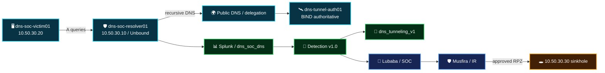

<a id="top"></a>


<div align="center">


<br/>


**A completed, evidence-backed DNS tunneling adversary-emulation case: real DNS transport, a frozen Splunk detection, information-separated SOC investigation, human-validated AI assistance, independent Incident Response, scoped RPZ containment, and verified safe reset.**

[🏗️ Infrastructure](https://github.com/DNSentinel-Lab/DNS-Lab-Infrastructure) · [🔎 Scenario 01](https://github.com/DNSentinel-Lab/Scenario-01-DNS-Recon) · [🧬 Scenario 02](https://github.com/DNSentinel-Lab/Scenario-02-DGA) · [🔄 Scenario 03](https://github.com/DNSentinel-Lab/Scenario-03-Fast-Flux) · [**🛰️ Scenario 04**](https://github.com/DNSentinel-Lab/Scenario-04-DNS-Tunneling)

</div>


## 🎯 Mission Brief

Scenario 04 asks a practical defender question:

> **Can defenders identify a short burst of fresh, encoded-looking DNS child labels, distinguish it from legitimate long DNS names, investigate it without operator ground truth, and prove a proportionate DNS-layer response without overstating attribution?**

| Field | Final scenario record |
|---|---|
| **Scenario** | DNS Tunneling |
| **Primary MITRE ATT&CK** | `T1071.004 — Application Layer Protocol: DNS` |
| **Cyber Kill Chain context** | Command & Control |
| **T1572** | Not claimed |
| **Victim / resolver-visible client** | `dns-soc-victim01 / 10.50.30.20` |
| **Defender resolver** | `dns-soc-resolver01 / 10.50.30.10` |
| **Controlled namespace** | `tunnel.soclab.abdul4rehman215.tech` |
| **Authoritative endpoint** | `dns-tunnel-auth01 / 10.60.10.30` |
| **Reusable sinkhole** | `dns-soc-sinkhole01 / 10.50.30.30` |
| **Final scenario state** | ✅ **Complete / evidence-backed closeout** |

### Role ownership

| Workstream | Owner | Final state |
|---|---|---|
| Scenario 04 infrastructure preparation | **Lubaba** | ✅ Complete |
| Detection Engineering / Dashboard / Alert / AI | **Abdul-Rehman** | ✅ Complete / v1.0 frozen |
| Project Lead / Private Exercise Operator | **Sonia** | ✅ Official execution complete |
| SOC Analyst / Threat Hunter | **Lubaba** | ✅ Investigation + IR handoff complete |
| Incident Responder / Defender | **Musfira** | ✅ Independent validation + response + reset complete |

> [!NOTE]
> The exercise used real project-owned DNS infrastructure and real defender telemetry, but it did **not** claim a real-world compromise, malware infection, confidential-data exfiltration, or attacker attribution. The realism comes from real protocol behavior, information separation, frozen controls, independent decisions, and verified response.


## 🌐 End-to-End Case Flow



The exercise kept private operator ground truth separate from the defender investigation until SOC and IR decisions were locked. That separation is what makes the final comparison meaningful.

**[Read the concise end-to-end execution record →](SCENARIO-04-EXECUTION.md)**


## 🚦 Scenario 04 Closeout Snapshot

The official resolver-visible burst occurred between **16:37:19.215675 and 16:37:31.370200 UTC** on `2026-09-02`.

| Observation | Final value |
|---|---:|
| DNS queries | **7** |
| Unique qnames | **7** |
| Unique child labels | **7** |
| Long-label count | **7** |
| Maximum first-label length | **27** |
| Query type | **A** |
| Resolver replies | **7 / 7 NOERROR** |
| Official alert | **16:39:01 UTC** |
| AI processed | **16:39:21 UTC** |
| SOC disposition | **INCONCLUSIVE — ESCALATION WARRANTED** |
| SOC confidence | **High** |
| RPZ validation | `*.tunnel... → 10.50.30.30` |
| Safe reset | Normal authoritative resolution restored |

The authoritative BIND log independently received the same seven generated names from public recursive resolvers. Its first and last receipt timestamps aligned with the Unbound defender timeline to within milliseconds.

```text
BIND first:   16:37:19.219 UTC
Unbound first:16:37:19.215675 UTC

BIND last:    16:37:31.375 UTC
Unbound last: 16:37:31.370200 UTC
```


## 🧠 Detection Engineering — Abdul-Rehman

Detection Engineering was completed and frozen **before** the official exercise. Abdul-Rehman moved from trusted resolver telemetry to baseline, explainable feature engineering, hunting, Dashboard Studio, controlled positive/benign testing, scheduled alerting, raw-event drilldown, and the `dns_tunneling_v1` AI evidence contract.

Frozen Detection v1.0:

```text
unique_child_labels >= 5
AND long_label_count >= 5
AND max_first_label_length > 16
```


*The frozen Dashboard Studio investigation surface gave the SOC analyst client, child-label, length, parent-domain, qtype/rcode, timeline and raw-event pivots without deciding the verdict for her.*

**[Read Abdul-Rehman's Detection Engineering story →](detection-engineering/DETECTION-ENGINEERING.md)**


## 🧬 Operator Execution — Sonia

Sonia used a finite lab-only client on `dns-soc-victim01`. It Base32-encoded a harmless synthetic training message into **seven DNS-safe child labels** and issued ordinary A lookups through the victim's normal resolver.


*What this proves: the seven unique child labels were generated from the intended victim path rather than from the defender tooling or a Splunk test search.*

The client was executed once during review before the formal execution gate. Instead of rerunning it for a cleaner timeline, Sonia preserved that real one-time session, verified the client had exited, and continued with evidence preservation. That deviation is documented as an operational lesson rather than hidden.


*What this proves: all seven generated qnames reached the project-controlled authoritative BIND endpoint. Fourteen BIND log rows reflected duplicate arrivals through public recursive resolvers, not fourteen victim requests.*

**[Read Sonia's Project Lead / Adversary story →](attacker/PROJECT-LEAD-ADVERSARY.md)**


## 🔎 SOC Investigation — Lubaba

Lubaba worked from defender-visible evidence without private operator timing, payload, generated qname list, or BIND ground truth. She independently reconstructed the one-minute behavior and reproduced every frozen Detection v1.0 condition.


*What this proves: the suspicious one-minute window contained 7 queries, 7 unique child labels, 7 long labels and a maximum first-label length of 27.*

She then challenged the result against measured normal behavior. Legitimate AWS DNS traffic also contained long labels, but no non-Scenario-04 parent reproduced the same **combined** short-window pattern.


The human hypothesis was written **before** AI review. The AI result was then checked claim by claim against raw DNS evidence and rated **CORRECT**, while `human_validation_required=true` remained preserved.

Lubaba's final decision was intentionally cautious:

> **INCONCLUSIVE — ESCALATION WARRANTED**  
> **Confidence: High**

She had strong evidence of DNS tunneling-like structure, but not enough endpoint/process/authorization evidence to claim malware, compromise, payload transfer, exfiltration, or attacker identity.

**[Read Lubaba's SOC investigation →](soc/SOC-ANALYST-INVESTIGATION.md)**


## 🛡️ Incident Response — Musfira

Musfira treated the SOC handoff as claims to validate, not as a verdict to repeat. IR independently reproduced the DNS evidence, checked available telemetry, reviewed VPC flows, narrowed CloudTrail context, and tested recurrence.


A particularly important IR decision came from network correlation. HTTPS flows existed after the DNS burst, but the same destinations were already active **before** it. Musfira therefore rejected a causal claim that the DNS activity produced those HTTPS connections.


After authorization context was established, IR performed a controlled, temporary response validation using the existing Unbound RPZ framework.

```text
*.tunnel.soclab.abdul4rehman215.tech
        ↓
10.50.30.30
```


*What this proves: the victim received the sinkhole address and Unbound telemetry independently recorded `rpz: applied [dns-soc-rpz]`.*

After evidence capture, Musfira restored the pre-change RPZ state and verified normal authoritative resolution returned.


**[Read Musfira's Incident Response story →](ir/INCIDENT-RESPONSE.md)**


## 🤖 AI Stayed Advisory

```text
raw evidence
    ↓
analyst hypothesis
    ↓
AI review
    ↓
claim-by-claim validation
    ↓
human disposition
```

The official alert produced a Scenario 04 AI event through the shared bridge. Lubaba validated its client, parent, query count, child-label count, length metrics, A-query context and `T1071.004` mapping against the raw resolver evidence.

The AI did **not** close the case and did not claim proven malware or exfiltration. The final security decision remained human.

**[Read the Scenario 04 AI evidence mapping →](ai/scenario-04-ai-mapping.md)**


## 🎭 Final Ground-Truth Comparison

The final reveal compares what each layer actually knew:

```text
Operator ground truth
        ↕
Authoritative BIND receipt
        ↕
Unbound defender telemetry
        ↕
Detection v1.0
        ↕
AI assistance
        ↕
SOC conclusion
        ↕
IR conclusion + response proof
```

The strongest result is not simply that an alert fired. It is that the defenders independently reconstructed the same DNS behavior without private ground truth, preserved attribution limits, and then verified the response before restoring the environment.

**[Read the cross-role final comparison →](exercise/final-comparison.md)**


## 📁 Repository Guide

| Workspace | Purpose |
|---|---|
| [`detection-engineering/`](detection-engineering/) | Abdul-Rehman's engineering story, validation, freeze and lessons |
| [`spl/`](spl/) | Frozen baseline, hunting, Detection v1.0 and validation SPL |
| [`dashboard/`](dashboard/) | Frozen Dashboard Studio JSON and panel search reference |
| [`ai/`](ai/) | Scenario-specific `dns_tunneling_v1` evidence contract and official-use validation |
| [`attacker/`](attacker/) | Sonia's operator/adversary workspace, client code, commands and revealed ground truth |
| [`soc/`](soc/) | Lubaba's investigation story, 5W1H, AI validation, SPL and SOC→IR handoff |
| [`ir/`](ir/) | Musfira's independent IR story, SPL, response commands, containment and reset evidence |
| [`exercise/`](exercise/) | Information-separation protocol and final cross-role comparison |
| [`evidence/`](evidence/) | Master cross-role evidence index |
| [`screenshots/`](screenshots/) | Visual-evidence portal and engineering/operator image sets |

## ✅ Final State

```text
Infrastructure                         ✅ Complete
Detection Engineering / Dashboard      ✅ Complete
Detection v1.0                         ✅ Frozen
Official operator execution            ✅ Complete
Production alert                       ✅ Fired
SOC investigation                      ✅ Complete
AI human validation                    ✅ Complete
SOC → IR handoff                       ✅ Complete
IR independent validation              ✅ Complete
Human-approved RPZ response            ✅ Validated
Containment evidence                   ✅ Preserved
Safe reset                             ✅ Verified
Ground-truth comparison                ✅ Complete
Scenario 04 closeout                   ✅ Complete
```

> **SCENARIO 04 — COMPLETE / EVIDENCE-BACKED CLOSEOUT**


<div align="center">

**DNSentinel Scenario 04 · Evidence before verdict · Humans before automation**

[📋 Runbook](SCENARIO-RUNBOOK.md) · [🎬 Execution](SCENARIO-04-EXECUTION.md) · [🧾 Evidence](evidence/README.md) · [⬆ Back to top](#top)

</div>


