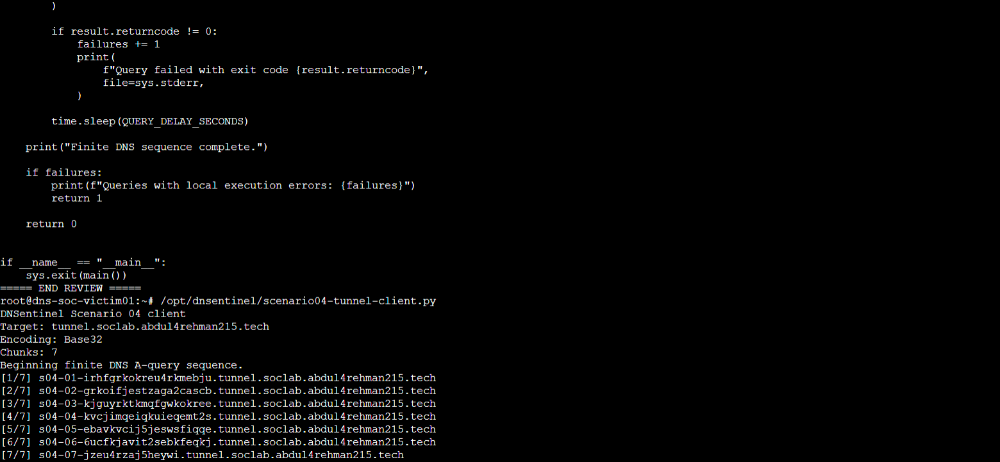

<a id="top"></a>


<div align="center">


[🏠 Scenario Home](README.md) · [🧾 Evidence](evidence/README.md)

</div>


# 🎬 Scenario 04 — End-to-End Execution

This is the short operational record of the completed DNS tunneling exercise. It connects the already-frozen engineering work with the official operator activity, defender telemetry, SOC investigation, Incident Response, temporary RPZ containment, safe reset and final reveal.

## 📌 1. Ready before execution

Before the official case:

- the victim used `10.50.30.10` as its normal resolver;
- the child namespace was delegated to `dns-tunnel-auth01`;
- Unbound query/reply telemetry was available in `dns_soc_dns`;
- Detection v1.0 was frozen at `5 / 5 / >16`;
- the Dashboard Studio investigation surface was frozen;
- the scheduled alert and `dns_tunneling_v1` AI path were operational;
- the reusable RPZ/sinkhole existed in a safe/non-enforcing state.

No live tuning was allowed after the official activity began.

## 📌 2. One finite operator DNS session

Sonia used the lab-only client on `dns-soc-victim01`. It encoded harmless synthetic training text with Base32, split it into seven DNS-safe chunks, and issued ordinary A lookups through the system resolver.



The client was executed once during review before the formal operator gate. The run was **not repeated**. The existing execution was preserved as the real scenario session instead of manufacturing replacement traffic.

The seven qnames reached BIND between:

```text
2026-09-02 16:37:19.219 UTC
2026-09-02 16:37:31.375 UTC
```


## 📌 3. Defender-visible behavior

Unbound independently recorded the original resolver-visible client `10.50.30.20`.

| Metric | Official suspicious window |
|---|---:|
| Queries | 7 |
| Unique qnames | 7 |
| Unique child labels | 7 |
| Long labels | 7 |
| Max first-label length | 27 |
| QTYPE | A |
| Replies | 7 |
| RCODE | NOERROR |
| Burst duration | ~12 seconds |

The BIND and Unbound timelines aligned without the SOC being given operator timing.

## 🧠 4. Frozen Detection v1.0 fired

The same one-minute logic built before execution independently matched:

```text
unique_child_labels >= 5      → 7 PASS
long_label_count >= 5         → 7 PASS
max_first_label_length > 16   → 27 PASS
```

The official alert fired at **16:39:01 UTC**.


## 🔎 5. SOC investigation

Lubaba investigated from defender evidence only. She:

- normalized DNS qnames and inspected raw labels;
- separated Unbound query and reply events to avoid double counting;
- reconstructed the exact one-minute detector behavior;
- validated the official alert against raw events;
- measured the normal first-label baseline;
- showed that legitimate AWS DNS also contains long labels;
- applied the full frozen rule to non-Scenario-04 traffic and got zero matches;
- scoped the pattern to one client, one parent and one one-minute window;
- formed a human hypothesis before reading AI;
- validated the AI event claim by claim;
- completed 5W1H and a defender-only IR handoff.

Final SOC disposition:

> **INCONCLUSIVE — ESCALATION WARRANTED**  
> **Confidence: High**

The behavior strongly resembled structured DNS tunneling, but the available defender evidence did not identify the originating process, user, malware, payload, compromise, exfiltration, attacker identity, intent or authorization.

## 🛡️ 6. Independent Incident Response

Musfira independently reproduced the seven queries and seven NOERROR replies. No victim endpoint telemetry suitable for process/user attribution was present in Splunk.

VPC Flow Logs showed HTTPS traffic after the burst. Musfira checked the same destinations before the burst and found them already active, so temporal proximity was **not** promoted into a false causal claim.

No later one-minute window reproduced Detection v1.0.

## 🤖 7. Controlled RPZ containment

After authorization context was established, IR exercised the approved response path:

```text
*.tunnel.soclab.abdul4rehman215.tech
        ↓
10.50.30.30
```

The first activation attempt did not change victim behavior. A later troubleshooting edit briefly broke RPZ parsing; backups were used to restore resolver health. The corrected no-trailing-dot wildcard was then loaded with configuration validation and a daemon reload/restart.


Splunk independently recorded the runtime policy:


## ♻️ 8. Safe reset

After proof was captured, the pre-change RPZ files were restored. `unbound-checkconf` passed, the service remained healthy, and the victim again received the normal authoritative answer observed during the exercise.


The response was therefore **applied, verified, and reversed cleanly**.

## 🏁 9. Final reveal

After SOC and IR conclusions were locked, private operator ground truth was compared against defender evidence.

| Ground truth | Defender result | Outcome |
|---|---|---|
| Victim `10.50.30.20` | Same resolver-visible client | ✅ Match |
| 7 generated qnames | 7 query rows / 7 unique qnames | ✅ Match |
| A lookups | A | ✅ Match |
| BIND first `16:37:19.219` | Unbound first `16:37:19.215675` | ✅ Aligned |
| BIND last `16:37:31.375` | Unbound last `16:37:31.370200` | ✅ Aligned |
| Harmless Base32 source content | SOC did not decode/infer contents | ✅ Correct evidence boundary |
| Authorized operator activity | SOC could not prove authorization | ✅ Correct escalation |
| Controlled containment expected later | IR proved RPZ behavior and safe reset | ✅ Verified |

## 🏁 ✅ Final outcome

> **Scenario 04 completed successfully as a realistic, information-separated DNS tunneling adversary-emulation and response exercise.** The frozen detector surfaced the behavior without live tuning; SOC independently proved the anomaly while preserving attribution limits; AI remained advisory; IR independently reproduced the evidence, rejected unsupported network causation, validated a narrow RPZ response, and restored the resolver safely.

Continue to:

- [Detection Engineering](detection-engineering/DETECTION-ENGINEERING.md)
- [Project Lead / Adversary](attacker/PROJECT-LEAD-ADVERSARY.md)
- [SOC Analyst Investigation](soc/SOC-ANALYST-INVESTIGATION.md)
- [Incident Response](ir/INCIDENT-RESPONSE.md)
- [Final Comparison](exercise/final-comparison.md)


<div align="center">

[🏠 Scenario Home](README.md) · [⬆ Back to top](#top)

**Structure before suspicion. Evidence before attribution. Human approval before containment.**

</div>


