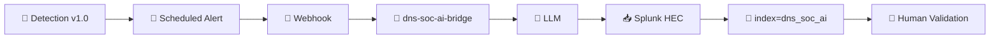

  

[🏠 Scenario Home](../README.md) · [🧠 Detection](../detection-engineering/README.md) · [🔎 SOC AI Validation](../soc/AI-VALIDATION.md)

# 🤖 Scenario 04 — AI-Assisted Evidence Review

Scenario 04 reused the shared DNSentinel Flask/OpenAI/HEC bridge. This repository owns only the scenario-specific evidence contract and validation record.

## 🔁 Evidence Path

## ✅ AI Could Summarize

- resolver-visible client and parent namespace;
- seven A-query events;
- unique-child-label and label-length evidence;
- the `T1071.004` behavioral context;
- important uncertainty and missing-evidence limitations.

## ⚖️ AI Could Not Prove

- malware;
- compromise;
- successful exfiltration or payload transfer;
- process/user identity;
- attacker identity;
- authorization status;
- whether containment was necessary.

The official alert fired at `16:39:01 UTC`; the AI event was processed at `16:39:21.727239 UTC`. Lubaba had already formed her human hypothesis and then rated the AI result **CORRECT** after claim-by-claim validation against raw defender evidence.

<table>
<tr>
<td width="50%"> <b>Engineering proof:</b> the bridge returned structured Scenario 04 evidence to Splunk.</td>
<td width="50%"> <b>SOC proof:</b> human validation remained explicit.</td>
</tr>
</table>

## 🗂️ Artifacts

- [`scenario-04-ai-mapping.md`](scenario-04-ai-mapping.md) — exact evidence contract
- [`../soc/AI-VALIDATION.md`](../soc/AI-VALIDATION.md) — official human review

> **Authority boundary:** AI can summarize the available evidence. It cannot inherit analyst or responder decision authority.

[🏠 Scenario Home](../README.md) · [📖 AI Mapping](scenario-04-ai-mapping.md) · [🔎 SOC Validation](../soc/AI-VALIDATION.md)

 

**AI may assist the reasoning. Evidence and humans own the verdict.**

[⬆ Back to top](#top)

