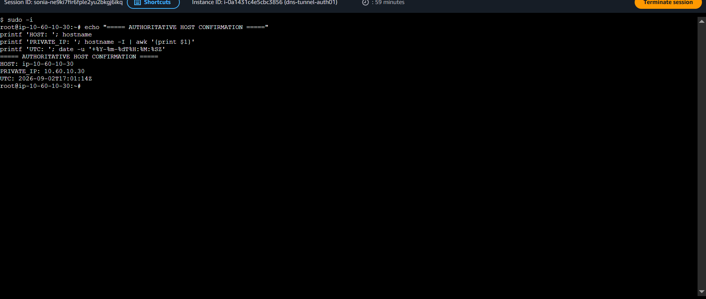

<a id="top"></a>

> 🧭 [Scenario 04](../README.md) › [Operator / Adversary](README.md) › **Project Lead / Private Exercise Operator**

<div align="center">

  

</div>

# 🧬 Project Lead / Private Exercise Operator — Sonia

Scenario 04 began conceptually after compromise. Sonia's role was not to add phishing, exploitation or malware; it was to generate one controlled DNS data-carriage pattern from the victim and preserve the private facts that defenders were intentionally not allowed to know.

## 1. Define the operator boundary

The observable DNS had to originate from:

```text
dns-soc-victim01 / 10.50.30.20
```

and use the normal resolver:

```text
dns-soc-resolver01 / 10.50.30.10
```

That mattered because Unbound is the defender source that preserves original client identity. Generating the official traffic from Kali would have broken the intended case model.

The target was permanently restricted to:

```text
tunnel.soclab.abdul4rehman215.tech
```

## 2. Build a finite lab-only client

The exact client is preserved in [`scripts/scenario04-tunnel-client.py`](scripts/scenario04-tunnel-client.py).

Its behavior was deliberately narrow:

```text
harmless synthetic text
        ↓
Base32
        ↓
20-character chunks
        ↓
s04-01 ... s04-07 child labels
        ↓
ordinary A queries
        ↓
2-second delay
        ↓
finite exit
```

It had no interactive shell, persistence, credential access, discovery, scanning, lateral movement, malware installation or third-party target capability.

## 3. Preserve the real one-time execution

During client review, the utility was run once before the formal operator execution gate.


*What this proves: the real seven-query sequence came from the victim and used the frozen client artifact.*

That was an execution-control deviation, but the right response was **not** to rerun the traffic for a cleaner story. Sonia preserved what had actually happened, verified the process had exited, and treated this one-time sequence as the official operator session.

> **Operational lesson:** evidence integrity is more important than making a timeline look perfect.

## 4. Validate the defender DNS path


The victim remained configured to use `10.50.30.10`, preserving the same defender path that Detection Engineering had validated.

## 5. Verify the correct authoritative host

A BIND health command was initially run on the victim host. The output correctly showed no `named.service` there. Instead of treating that as an infrastructure failure, Sonia confirmed the host identity and moved to `dns-tunnel-auth01 / 10.60.10.30`.



*What this proves: service interpretation was anchored to the correct host before conclusions were drawn.*

The public authoritative endpoint was also revalidated because its public IPv4 was auto-assigned rather than an Elastic IP. The address observed during this exercise remained `98.93.89.38`.

## 6. Prove response controls were not already interfering


The reusable RPZ existed, but Scenario 04 containment was not enforcing before the official case. That distinction mattered: the presence of a security control does not prove a scenario-specific rule is active.

## 7. Recover authoritative ground truth

BIND logged all seven generated qnames.


Authoritative receipt window:

```text
first: 2026-09-02 16:37:19.219 UTC
last:  2026-09-02 16:37:31.375 UTC
```

The log contained **14 records** because each distinct name arrived twice through public recursive resolvers. That did **not** mean the victim executed 14 requests.

Architecture-specific evidence meaning:

```text
Unbound = client attribution / victim request count
BIND    = authoritative receipt / ground truth
```

## 8. Keep ground truth private until reveal

Sonia did not give Lubaba or Musfira:

- the source message;
- exact generated qnames;
- operator timing;
- expected query count;
- BIND receipt evidence;
- expected detection outcome.

The complete revealed record is now preserved in [`ground-truth.md`](ground-truth.md).


## 9. What Sonia proved

Sonia demonstrated the operator side of a realistic DNS tunneling case without turning the lab client into a general-purpose offensive tool. She **constrained** the namespace, **generated** the finite pattern, **preserved** a real deviation instead of rewriting it, **validated** the resolver path, **verified** authoritative receipt, and **maintained** information separation until the defender record was complete.

---

[🏠 Scenario Home](../README.md) · [📄 Ground Truth](ground-truth.md) · [🧠 Learning Journey](LEARNING-JOURNEY.md) · [⬆ Back to top](#top)
