  

[🏠 Scenario Home](../README.md) · [🎬 Execution](../SCENARIO-04-EXECUTION.md) · [💻 Commands](commands/README.md) · [🎭 Exercise](../exercise/README.md)

# 🎯 Scenario 04 Operator Workspace

[**Sonia**](https://github.com/sonia11mansha415) generated one finite, controlled tunneling-like DNS pattern from `dns-soc-victim01` while exact operator ground truth remained hidden from SOC and IR until their decisions were complete.

## 🚦 Execution Snapshot

| Field | Final ground truth |
|---|---|
| Operator | Sonia |
| Client | `scripts/scenario04-tunnel-client.py` |
| Namespace | `tunnel.soclab.abdul4rehman215.tech` |
| Queries | **7** |
| Unique child labels | **7** |
| Encoding | Base32-derived harmless synthetic training message |
| Query type | A |
| Spacing | 2 seconds |
| Resolver path | victim → defender Unbound → public DNS → authoritative BIND |
| Official run discipline | one finite session |
| Defender feedback | not used to steer execution |

## 🔁 Operator Flow

```mermaid
%%{init: {
  "theme": "base",
  "themeVariables": {
    "background": "#030712",
    "primaryTextColor": "#ffffff",
    "lineColor": "#f8fafc",
    "fontSize": "30px"
  },
  "flowchart": {
    "nodeSpacing": 52,
    "rankSpacing": 62,
    "curve": "basis",
    "padding": 20
  }
}}%%

flowchart TB

    %% =====================================================
    %% ROW 1 · EXECUTION
    %% =====================================================
    subgraph ROW1[" "]
        direction LR

        A["🔐 01 · PREFLIGHT"]

        B["🌐 02 · RESOLVER<br/>PATH"]

        C["🎯 03 · EXECUTE<br/>ONCE"]

        D["🛰️ 04 · AUTHORITATIVE<br/>RECEIPT"]

        A ==> B ==> C ==> D
    end


    %% =====================================================
    %% ROW 2 · PRESERVATION + REVEAL
    %% =====================================================
    subgraph ROW2[" "]
        direction LR

        E["🛑 05 · CLIENT<br/>EXIT"]

        F["🧾 06 · PRESERVE<br/>GROUND TRUTH"]

        G["🔒 07 · KEEP<br/>HIDDEN"]

        H["🎭 08 · FINAL<br/>REVEAL"]

        E ==> F ==> G ==> H
    end


    %% =====================================================
    %% ROW-TO-ROW HANDOFF
    %% Keeps Mermaid from stretching into one long line
    %% =====================================================
    ROW1 ==> ROW2


    %% =====================================================
    %% PREMIUM NODE COLORS
    %% =====================================================

    classDef preflight fill:#172554,stroke:#60a5fa,stroke-width:6px,color:#ffffff,font-size:30px,font-weight:bold;

    classDef resolver fill:#075985,stroke:#22d3ee,stroke-width:6px,color:#ffffff,font-size:30px,font-weight:bold;

    classDef execute fill:#4c1d95,stroke:#c084fc,stroke-width:6px,color:#ffffff,font-size:30px,font-weight:bold;

    classDef receipt fill:#713f12,stroke:#fbbf24,stroke-width:6px,color:#ffffff,font-size:30px,font-weight:bold;

    classDef exit fill:#7f1d1d,stroke:#fb7185,stroke-width:6px,color:#ffffff,font-size:30px,font-weight:bold;

    classDef preserve fill:#0f766e,stroke:#5eead4,stroke-width:6px,color:#ffffff,font-size:30px,font-weight:bold;

    classDef hidden fill:#450a0a,stroke:#f87171,stroke-width:6px,color:#ffffff,font-size:30px,font-weight:bold;

    classDef reveal fill:#14532d,stroke:#86efac,stroke-width:7px,color:#ffffff,font-size:32px,font-weight:bold;


    %% =====================================================
    %% APPLY COLORS
    %% =====================================================
    class A preflight;
    class B resolver;
    class C execute;
    class D receipt;

    class E exit;
    class F preserve;
    class G hidden;
    class H reveal;


    %% =====================================================
    %% GLOSSY ROW PANELS
    %% =====================================================
    style ROW1 fill:#06121f,stroke:#38bdf8,stroke-width:3px

    style ROW2 fill:#0b130d,stroke:#4ade80,stroke-width:3px


    %% =====================================================
    %% THICK BRIGHT CONNECTORS
    %% =====================================================
    linkStyle default stroke:#f8fafc,stroke-width:6px;
```

## 🖼️ Operator Evidence Highlights

<table>
<tr>
<td width="33%"> <b>Execution:</b> the exact seven-query client session.</td>
<td width="33%"> <b>Resolver path:</b> victim stayed on defender-controlled DNS.</td>
<td width="33%"> <b>Response boundary:</b> Scenario 04 containment was not already active.</td>
</tr>
<tr>
<td width="50%"> <b>End-to-end proof:</b> all generated qnames reached BIND.</td>
<td width="50%" colspan="2"> <b>Closeout:</b> the real one-run timeline and deviation were preserved instead of hidden.</td>
</tr>
</table>

## 🗂️ Start Here

- [`PROJECT-LEAD-ADVERSARY.md`](PROJECT-LEAD-ADVERSARY.md) — flagship operator case study
- [`SCENARIO-04-ADVERSARY-PLAYBOOK.md`](SCENARIO-04-ADVERSARY-PLAYBOOK.md) — reusable operator method/boundary
- [`ground-truth.md`](ground-truth.md) — reveal-only ground truth
- [`LEARNING-JOURNEY.md`](LEARNING-JOURNEY.md) — operational learning journey
- [`commands/README.md`](commands/README.md) — safe environment/receipt checks
- [`scripts/scenario04-tunnel-client.py`](scripts/scenario04-tunnel-client.py) — exact finite lab-only client

> **Operator boundary:** prove what was intentionally generated. Do not use defender outcomes to steer the run.

[🏠 Scenario Home](../README.md) · [📖 Operator Story](PROJECT-LEAD-ADVERSARY.md) · [💻 Commands](commands/README.md) · [🎭 Exercise](../exercise/README.md)

 

**Preserve the ground truth. Preserve the information boundary.**

[⬆ Back to top](#top)

