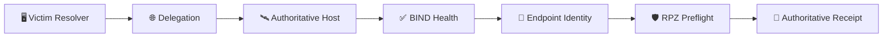

 

[🏠 Scenario Home](../../README.md) · [🎯 Operator Workspace](../README.md) · [📖 Ground Truth](../ground-truth.md)

# 💻 Scenario 04 — Operator Command Map

These scripts preserve the clean environment and receipt checks that materially supported the official operator session.

| File | Purpose |
|---|---|
| [`01-victim-resolver-check.sh`](01-victim-resolver-check.sh) | confirm victim uses defender resolver |
| [`02-delegation-check.sh`](02-delegation-check.sh) | validate child NS/SOA path |
| [`03-authoritative-host-confirm.sh`](03-authoritative-host-confirm.sh) | confirm correct EC2 host before BIND checks |
| [`04-authoritative-health.sh`](04-authoritative-health.sh) | validate BIND service, port 53 and query log |
| [`05-authoritative-endpoint-identity.sh`](05-authoritative-endpoint-identity.sh) | re-check public authoritative endpoint |
| [`06-rpz-preflight.sh`](06-rpz-preflight.sh) | prove Scenario 04 containment is not already enforcing |
| [`07-authoritative-receipt.sh`](07-authoritative-receipt.sh) | recover official `s04-01`…`s04-07` BIND receipt |

The exact finite client is [`../scripts/scenario04-tunnel-client.py`](../scripts/scenario04-tunnel-client.py).

> Preservation-only housekeeping was intentionally excluded from the public command index.

[🎯 Operator Workspace](../README.md) · [📖 Operator Story](../PROJECT-LEAD-ADVERSARY.md)

 

**Commands explain the evidence path; they do not replace the evidence.**

[⬆ Back to top](#top)

