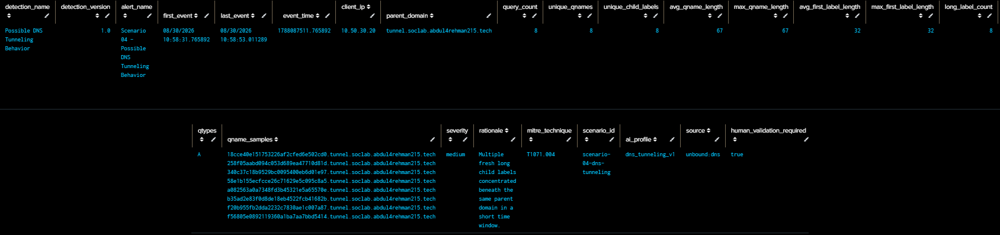
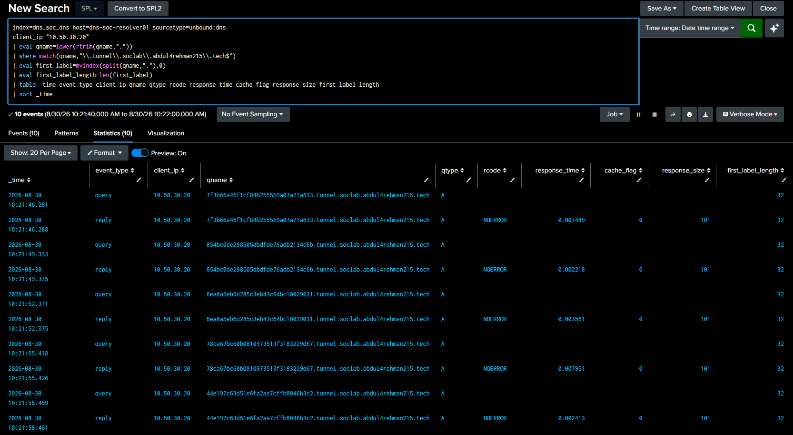

  

[🏠 Scenario Home](../README.md) · [🧠 Detection Engineering](../detection-engineering/README.md) · [📄 Panel Searches](PANEL-SEARCHES.md) · [🔎 SPL](../spl/README.md)

# 📊 Scenario 04 — Dashboard Studio

The dashboard was built only after the DNS feature fields were stable. It accelerates analyst pivots without deciding whether the behavior is malicious.

## 🖼️ Investigation Surface

## 🧭 Analyst Views

| View | Investigation question |
|---|---|
| Total DNS Queries | How much resolver activity occurred? |
| Unique Qnames | How broad was the activity? |
| Unique Child Labels | Are many fresh children appearing? |
| Active Clients | Which clients generated DNS activity? |
| DNS Queries per Minute | Is activity concentrated in time? |
| First-Label Length Over Time | Are child labels unusually long? |
| Query Type Mix | Which DNS record types were used? |
| Response Code Mix | How did DNS respond? |
| Top Parent Domains | Where is child-label activity concentrated? |
| DNS Behavior Window Summary | Which windows satisfy the behavior contract? |
| Raw Event Drilldown | Can the analyst inspect original resolver evidence immediately? |

<table>
<tr>
<td width="50%"> <b>Evidence row:</b> summary fields needed for analyst review.</td>
<td width="50%"> <b>Raw drilldown:</b> original resolver evidence remains one pivot away.</td>
</tr>
</table>

> **Dashboard rule:** make the evidence easier to interrogate; never turn the visualization into a verdict.

[🏠 Scenario Home](../README.md) · [🧠 Detection Engineering](../detection-engineering/README.md) · [📄 Panel Searches](PANEL-SEARCHES.md)

 

**A dashboard is useful when every panel answers an investigation question.**

[⬆ Back to top](#top)

