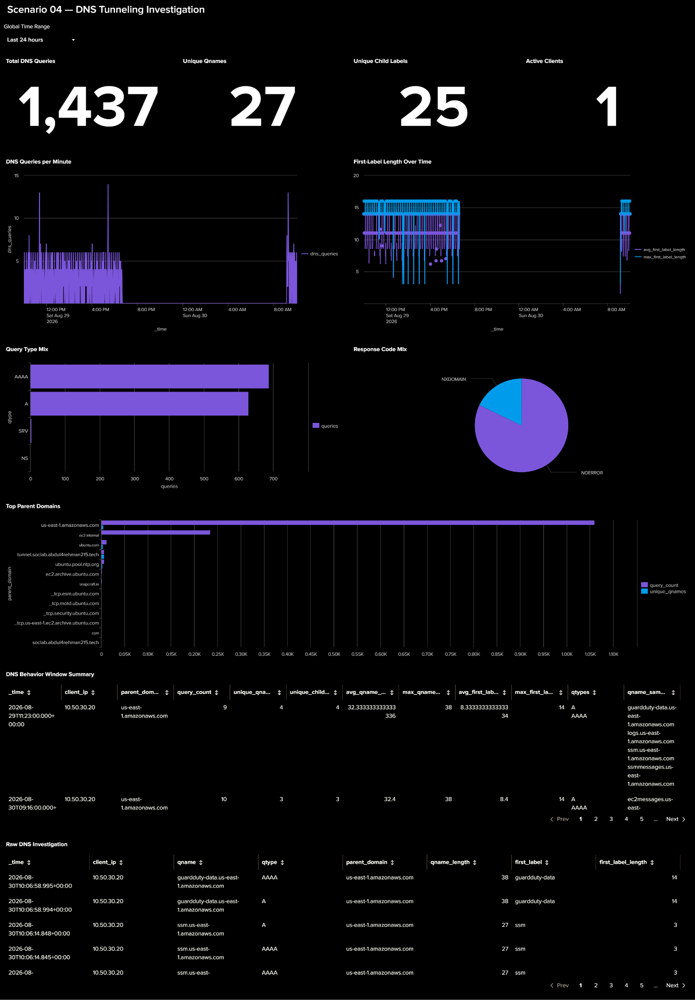

[🏠 Scenario Home](../README.md) · [🛠️ Detection Engineering](../detection-engineering/DETECTION-ENGINEERING.md) · [📄 Panel Searches](PANEL-SEARCHES.md)

## Scenario 04 — DNS Tunneling Investigation

The dashboard was built after the DNS feature fields were stable. It is an **investigation surface**, not a malicious/benign verdict.

### Implemented analyst views

| View | Investigation question |
|---|---|
| Total DNS Queries | How much resolver activity occurred? |
| Unique Qnames | How broad was the activity? |
| Unique Child Labels | Are many fresh children appearing? |
| Active Clients | Which clients generated DNS activity? |
| DNS Queries per Minute | Is activity concentrated in time? |
| First-Label Length Over Time | Are child labels becoming unusually long? |
| Query Type Mix | Which DNS record types were used? |
| Response Code Mix | How did DNS respond? |
| Top Parent Domains | Where is child-label activity concentrated? |
| DNS Behavior Window Summary | Which client/parent windows need review? |
| Raw DNS Investigation | Which exact Unbound events support the summary? |

## Official SOC use

Lubaba used this frozen investigation surface during the official information-separated case. The dashboard supported triage and raw-event pivots, but the final disposition still came from the analyst's independent evidence review.

## Exported implementation

- [`scenario-04-dns-tunneling-investigation-dashboard.json`](scenario-04-dns-tunneling-investigation-dashboard.json) — final Dashboard Studio source.
- [`PANEL-SEARCHES.md`](PANEL-SEARCHES.md) — panel/data-source search reference.

## QA lesson

The first exported JSON revealed that **Query Type Mix** and **Response Code Mix** were connected to each other's data sources even though the underlying searches were correct. The bindings were corrected before the dashboard was frozen.

That review mattered because a dashboard can display technically valid data beneath the wrong title. The final export was therefore checked as configuration, not only as a screenshot.

> The dashboard remained frozen during the official SOC case. IR response proof is documented in the IR workspace rather than retrofitted into the already-frozen analyst dashboard.

[🏠 Scenario Home](../README.md) · [⬆ Back to top](#top)

