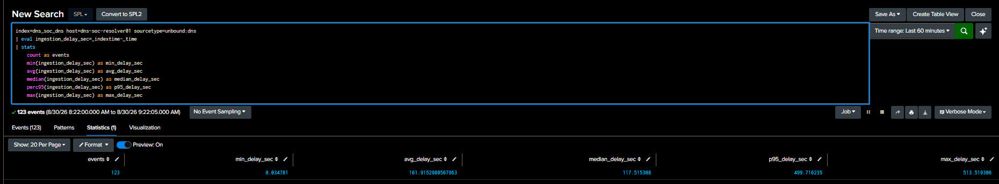
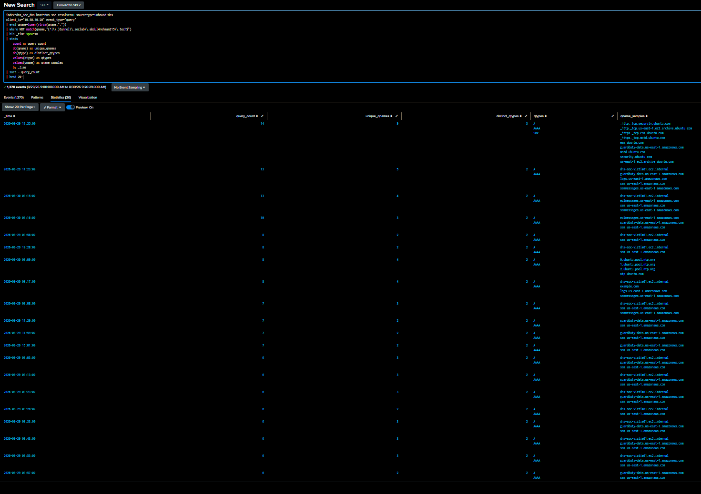
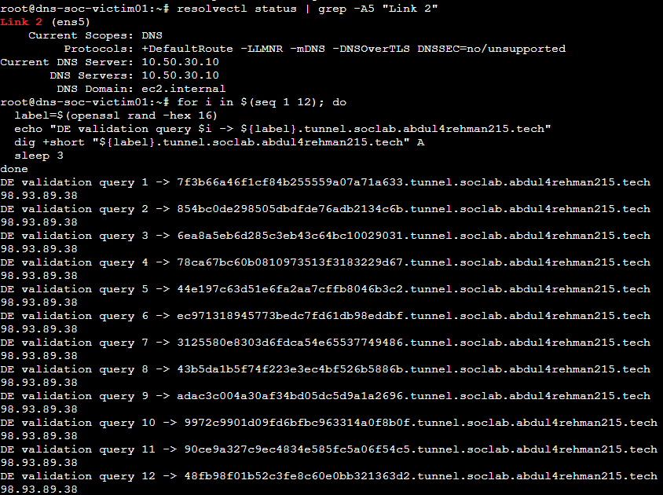
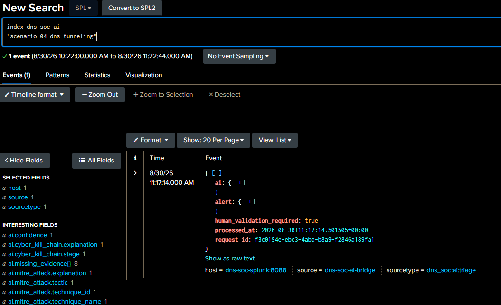
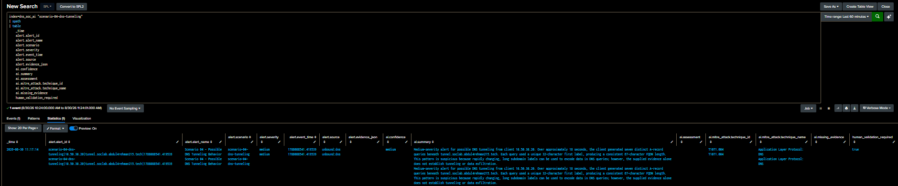

<a id="top"></a>

> 🧭 [Scenario 04](../README.md) › **Detection Engineering — From Resolver Telemetry to a Frozen DNS Tunneling Detection**


---

# Scenario 04 Detection Engineering — From Resolver Telemetry to a Frozen DNS Tunneling Detection

**Detection Engineer / AI Integrator:** [Abdul-Rehman](https://github.com/abdul4rehman215)  
**Scenario:** DNS Tunneling  
**Primary MITRE ATT&CK:** `T1071.004 — Application Layer Protocol: DNS`  
**Engineering status:** **Complete / SOC-Ready**  
**Official scenario status:** **Simulation / SOC / IR still pending**

This document records the Detection Engineering work that turned live Unbound resolver telemetry into a tested Splunk detection, analyst investigation dashboard, scheduled alert, raw-event investigation path and Scenario 04 AI evidence flow.

The work is presented as an engineering story rather than a chat transcript: **question → observation → decision → action → validation → lesson**.

> [!IMPORTANT]
> The traffic used here was **Detection Engineering validation traffic** with synthetic, non-sensitive data inside the project-owned DNS namespace. It was not Sonia's official Scenario 04 exercise.

---

## 1. Engineering finish line

Abdul-Rehman's task was not complete when one SPL search returned a row. The phase was accepted only after this chain worked:

```text
real Unbound events
    → trusted fields and event semantics
    → ingestion timing
    → clean normal baseline
    → DNS feature engineering
    → threshold-free hunting
    → investigation dashboard
    → controlled positive test
    → benign lookalike challenge
    → Detection v1.0
    → validation SPL
    → scheduled alert
    → analyst evidence contract
    → raw-event drilldown
    → Scenario 04 AI profile
    → AI result returned to Splunk
    → AI claims checked against source evidence
    → freeze before official exercise
```

This finish line matters because a detection that cannot be explained, validated or investigated is not ready for a SOC handoff.

---

## 2. Start with the resolver, not assumptions

### Question

What does the defender actually see when the victim makes DNS requests through the Scenario 04 path?

### What Abdul-Rehman validated

The live path remained:

```text
dns-soc-victim01 10.50.30.20
        ↓
dns-soc-resolver01 10.50.30.10 / Unbound
        ↓
public recursive DNS / Route 53 delegation
        ↓
dns-tunnel-auth01 / BIND authoritative-only
        ↓
tunnel.soclab.abdul4rehman215.tech
```

Primary SOC/client-attribution telemetry:

```text
index=dns_soc_dns
host=dns-soc-resolver01
sourcetype=unbound:dns
```

Validated live fields included:

```text
event_type
client_ip
qname
qtype
rcode
response_time
cache_flag
response_size
```


*Live Unbound telemetry confirmed the real victim identity, resolver source and extracted DNS fields before detection logic was written.*

### The event-model detail that changed the counting logic

Unbound records separate `query` and `reply` events. A careless count would make one DNS transaction look like two requests.

Abdul-Rehman therefore used:

```text
event_type="query"
```

for baseline, hunting and production behavior counting. Reply rows remained valuable for response context such as `rcode`, response time and response size.

### Lesson

**Understand the telemetry model before you trust a count.** SIEM records can be accurate and still require semantic interpretation.

---

## 3. Measure ingestion before choosing alert timing

### Question

How late can resolver events arrive in Splunk, and what search window should a scheduled rule use?

A 60-minute sample initially produced:

| Metric | Observed value |
|---|---:|
| Events | 123 |
| Minimum delay | ~0.03 s |
| Average delay | ~161.9 s |
| Median delay | ~117.5 s |
| P95 | ~499.7 s |
| Maximum | ~513.5 s |



*The first aggregate view looked slow enough to question the pipeline, so the distribution was investigated instead of immediately changing the architecture.*

### What changed after event-level inspection

The newest DNS events were arriving in approximately **0.03–0.8 seconds**. The much larger median/P95/max values came from older delayed/backlogged events inside the same time range.

That changed the interpretation:

```text
current pipeline → healthy / near real-time
historical sample → contains delayed backlog/outliers
```

### Engineering decision

Do not rewrite the working resolver or detection. Use a conservative scheduled lookback that can tolerate delayed delivery while still avoiding a still-forming minute.

### Lesson

**A summary metric can hide a healthy current system.** Inspect the underlying events before turning a historical outlier into an infrastructure change.

---

## 4. Build a baseline — then clean the baseline

### First baseline

The initial 24-hour victim view showed:

- 1,369 DNS queries;
- 27 unique qnames;
- average qname length ~32.23;
- median 29;
- P95 38;
- maximum qname length 48;
- A, AAAA, NS and SRV activity.

At first, a maximum of 48 looked important.

### The baseline problem

When the longest names were inspected, the top results included Scenario 04 pre-flight and smoke-test names. Engineering traffic had contaminated the normal baseline.

Abdul-Rehman separated the controlled tunnel namespace from clean normal DNS instead of quietly accepting those test names as normal behavior.

### Clean normal profile

| Measurement | Clean result |
|---|---:|
| Query count | 1,368 |
| Unique qnames | 20 |
| Average qname length | ~32.17 |
| Median qname length | 29 |
| P95 qname length | 38 |
| Maximum normal qname length | 43 |
| Normal qtypes | A, AAAA, SRV |

Normal short-window analysis also showed:

- busiest normal one-minute period: **14 queries** and **9 unique qnames**;
- parent-specific normal one-minute behavior: up to **4 unique children**;
- clean normal first-label maximum: **16**;
- busy-window first-label maximum around **14**.



*The baseline was treated as an engineering dataset rather than a magic number: known validation traffic was separated before thresholds were chosen.*

### What the baseline ruled out

```text
whole qname > 40     → too weak
high DNS volume      → too weak
A/AAAA/SRV presence  → context only
```

A legitimate service-style qname could reach 43 characters simply because it contained several normal labels.

### Lesson

**Your own test traffic can corrupt your baseline.** Clean known engineering activity before using baseline maxima to define suspicious behavior.

---

## 5. Engineer features that match DNS tunneling-like structure

The baseline moved the analysis away from whole-FQDN length and toward the child label where synthetic tunnel-like content would appear.

Useful derived fields included:

```text
qname_length
first_label
first_label_length
label_count
parent_domain
query_count
unique_qnames
unique_child_labels
qtype context
```

Character/digit mix was explored but stayed supporting context. A single-digit NTP label could produce an extreme digit ratio even though the behavior was ordinary. Entropy was not needed to separate the positive sample from the baseline and benign challenge.


*Threshold-free hunting compared first-label length, parent concentration and child uniqueness before the production rule had any fixed threshold.*

### Stronger hypothesis

```text
same client
+
same parent domain
+
short time window
+
many fresh child labels
+
child labels longer than the measured clean-normal first-label maximum
=
possible DNS tunneling-like behavior
```

### Lesson

**Feature engineering should match the protocol behavior you are trying to explain.** In this environment, first-label structure was more useful than whole-qname length alone.

---

## 6. Build the analyst surface before freezing the alert

Abdul-Rehman built **Scenario 04 — DNS Tunneling Investigation** in Splunk Dashboard Studio.


The dashboard contains 11 purposeful views:

1. Total DNS Queries
2. Unique Qnames
3. Unique Child Labels
4. Active Clients
5. DNS Queries per Minute
6. First-Label Length Over Time
7. Query Type Mix
8. Response Code Mix
9. Top Parent Domains
10. DNS Behavior Window Summary
11. Raw DNS Investigation

The exact export is preserved in [`../dashboard/scenario-04-dns-tunneling-investigation-dashboard.json`](../dashboard/scenario-04-dns-tunneling-investigation-dashboard.json).

### A dashboard QA issue that was worth keeping

The first exported JSON connected **Query Type Mix** and **Response Code Mix** to each other's data sources. The searches themselves were correct; the visualization bindings were not.

Abdul-Rehman corrected the mappings and re-exported the final dashboard.

### Lesson

**A dashboard can show valid data under the wrong label.** Audit datasource bindings as well as the visual appearance before freezing an analyst surface.

---

## 7. Positive validation — make the rule see the intended behavior

A small Detection Engineering sample generated 12 synthetic/non-sensitive child labels using random 32-hex-character first labels under the controlled Scenario 04 zone.



*The validation traffic travelled through the real victim → Unbound → public delegation → authoritative BIND path and used only project-owned synthetic data.*

The burst crossed a minute boundary:

| Window | Queries | Unique qnames | Unique children | First-label length | Qname length | Qtype |
|---|---:|---:|---:|---:|---:|---|
| First minute | 5 | 5 | 5 | 32 | 67 | A |
| Second minute | 7 | 7 | 7 | 32 | 67 | A |


*The positive behavior separated from normal parent-domain activity even though the generated burst crossed a minute boundary.*

Crossing the boundary was useful because the candidate still had to recognize the behavior; it could not depend on a conveniently aligned test bucket.

---

## 8. Benign challenge — prove that “long” is not enough

A second validation repeatedly queried one fixed long child label 12 times.

It had two superficially suspicious properties:

- long label;
- repeated DNS requests.

But it had only **one unique child**.


*The candidate result remained limited to the earlier controlled-positive windows; the repeated-long-label lookalike did not create a new detection row.*

This validated an important distinction:

```text
long hostname       ≠ tunnel
many queries        ≠ tunnel
A record            ≠ benign or malicious by itself
fresh long children + parent concentration = stronger signal
```

---

## 9. Freeze Detection v1.0 from measured evidence

The final conditions became:

```text
unique_child_labels >= 5
AND long_label_count >= 5
AND max_first_label_length > 16
```

where `long_label_count` counts first labels with `first_label_length > 16`.

### Why these values exist

- normal parent/window unique-child behavior reached **4**;
- clean normal first-label maximum was **16**;
- controlled positive produced **5–7** unique long children per minute with length **32**;
- benign repeated-long-label behavior had only **1** unique child.


*The frozen rule returned the intended positive windows using the same measured thresholds that were later operationalized.*

Detection metadata:

```text
Detection name: Possible DNS Tunneling Behavior
Detection version: 1.0
Alert name: Scenario 04 - Possible DNS Tunneling Behavior
Scenario ID: scenario-04-dns-tunneling
AI profile: dns_tunneling_v1
Severity: medium
MITRE: T1071.004
Human validation required: true
```

`T1572` is not claimed because this engineering validation did not establish a separate encapsulated protocol channel.

---

## 10. Turn the rule into analyst-ready evidence

The production result returns one concise row per client/parent/window rather than flooding the analyst with raw events.

Key fields include:

```text
first_event / last_event
client_ip
parent_domain
query_count
unique_qnames
unique_child_labels
avg/max qname length
avg/max first-label length
long_label_count
qtypes
qname_samples
severity
rationale
mitre_technique
scenario_id
ai_profile
human_validation_required
```

The same result also includes bridge fields:

```text
alert_id
alert_name
scenario
event_time
source
evidence_json
```


*The scheduled result compresses the behavior into a usable case lead without removing the evidence needed for verification.*

### Raw evidence stays one pivot away


*The underlying Unbound query/reply pairs remain recoverable from the summarized detection window.*

That separation gives the SOC both views:

```text
summary → what pattern happened?
raw DNS → which exact events prove it?
```

---

## 11. Productionize it as a scheduled alert

Final configuration:

```text
Alert: Scenario 04 - Possible DNS Tunneling Behavior
Type: Scheduled
Cron: * * * * *
Earliest: -10m@m
Latest: -1m@m
Trigger: Number of Results > 0
Trigger mode: Once
Suppression: 10 minutes
Severity: Medium
Actions:
  - Add to Triggered Alerts
  - Webhook → http://dns-soc-ai-bridge:5000/splunk-webhook
```


*Splunk's scheduler independently executed the frozen search and produced the operational alert rather than relying on a manual Search & Reporting run.*

### Why the window is wider than the current sub-second ingest

The timing sample contained historical delayed/backlogged events reaching roughly 8–9 minutes. The 10-minute lookback tolerates that risk, while `latest=-1m@m` avoids evaluating a minute that is still being formed.

The 10-minute suppression was also validated so the same evidence would not be pushed repeatedly through the overlapping scheduled window.

---

## 12. Extend the evidence contract to the shared AI bridge

The detection was already useful to a human, but the shared bridge needed wrapper fields such as `alert_id`, `scenario` and `evidence_json`.

Abdul-Rehman did **not** rewrite the detection behavior to solve that integration problem. He extended only the evidence contract.

Scenario profile:

```text
scenario_id = scenario-04-dns-tunneling
scenario    = scenario-04-dns-tunneling
ai_profile  = dns_tunneling_v1
```

Transport:

```text
scheduled alert
    → dns-soc-ai-bridge
    → OpenAI
    → Splunk HEC
    → index=dns_soc_ai
```



*The Scenario 04 AI event returned to Splunk through the shared bridge and HEC path.*

### AI vs evidence validation

The returned AI event was compared with the scheduled detection evidence.

For the evaluated alert, the source evidence showed:

- client `10.50.30.20`;
- 7 distinct A-record queries;
- parent `tunnel.soclab.abdul4rehman215.tech`;
- 32-character first labels;
- 67-character FQDNs;
- MITRE `T1071.004`.



*The AI described the same numerical/context facts and explicitly stopped short of claiming that the supplied evidence proved tunneling or data exfiltration.*

`human_validation_required=true` remained preserved.

### Lesson

**Transport success and schema success are different layers.** Fix a payload-contract problem at the contract boundary; do not change known-good detection logic to compensate for it.

---

## 13. What Abdul-Rehman deliberately did not put into v1.0

Several tempting signals were kept out of the final decision because the measured data did not justify them as mandatory conditions:

- NXDOMAIN;
- TXT activity;
- entropy;
- whole-qname length alone;
- character/digit ratio alone;
- high query volume alone;
- a known validation prefix.

That keeps the rule behavior-based rather than test-specific.

---

## 14. Known limitation

Detection v1.0 is intentionally explainable and narrow. A deliberately low-and-slow tunneling-like channel that stays inside normal child-label length, unique-child count and short-window behavior may evade this version.

The rule also does not claim:

- malware identity;
- attacker attribution;
- exfiltrated content;
- confirmed C2 compromise;
- protocol tunneling beyond the DNS behavior actually observed.

Those are investigation questions, not detection fields.

---

## 15. Engineering reflection

The most useful parts of this assignment were the moments where an apparently obvious answer turned out to be incomplete.

A latency summary looked unhealthy until recent events were inspected. A qname-length threshold looked attractive until legitimate service names were measured. The first baseline looked clean until pre-flight traffic was found inside it. The dashboard looked correct until its exported datasource bindings were audited. The alert was analyst-ready before it was bridge-schema-ready.

Abdul-Rehman kept the working layers stable, isolated the boundary that was actually wrong, and validated each correction before moving forward.

By the end of the phase, the work was no longer just SPL. It connected DNS semantics, baseline analysis, feature engineering, Dashboard Studio, scheduled alerting, raw-event investigation, structured webhook evidence and AI validation into one frozen SOC handoff.

---

## 16. Final state and freeze boundary

**SCENARIO 04 DETECTION ENGINEERING = COMPLETE / SOC-READY**

Frozen artifacts include:

- [`../spl/detection.spl`](../spl/detection.spl) — Detection v1.0;
- [`../spl/validation.spl`](../spl/validation.spl) — same frozen logic used for validation;
- [`../dashboard/scenario-04-dns-tunneling-investigation-dashboard.json`](../dashboard/scenario-04-dns-tunneling-investigation-dashboard.json) — final Dashboard Studio export;
- [`../ai/scenario-04-ai-mapping.md`](../ai/scenario-04-ai-mapping.md) — Scenario 04 evidence contract;
- [`FREEZE-RECORD.md`](FREEZE-RECORD.md) — operational/change-control record;
- [`detection-engineering-validation.md`](detection-engineering-validation.md) — acceptance matrix.

Official simulation, SOC disposition, IR validation/containment and final scenario closeout remain pending.

---

[🏠 Scenario Home](../README.md) · [✅ Validation](detection-engineering-validation.md) · [🔒 Freeze Record](FREEZE-RECORD.md) · [🧠 Lessons](TROUBLESHOOTING-AND-LESSONS.md) · [⬆ Back to top](#top)
