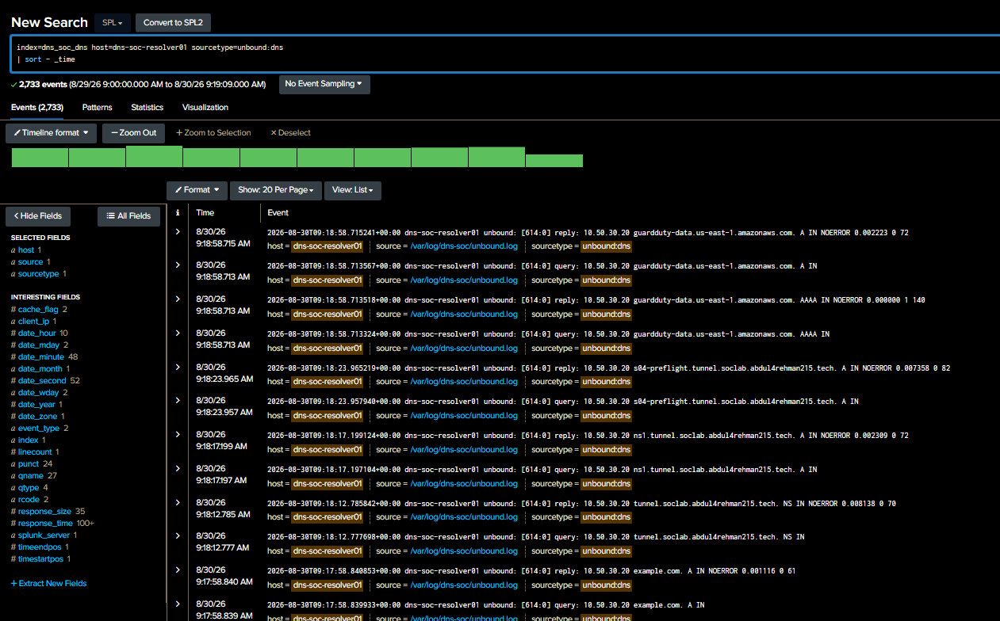
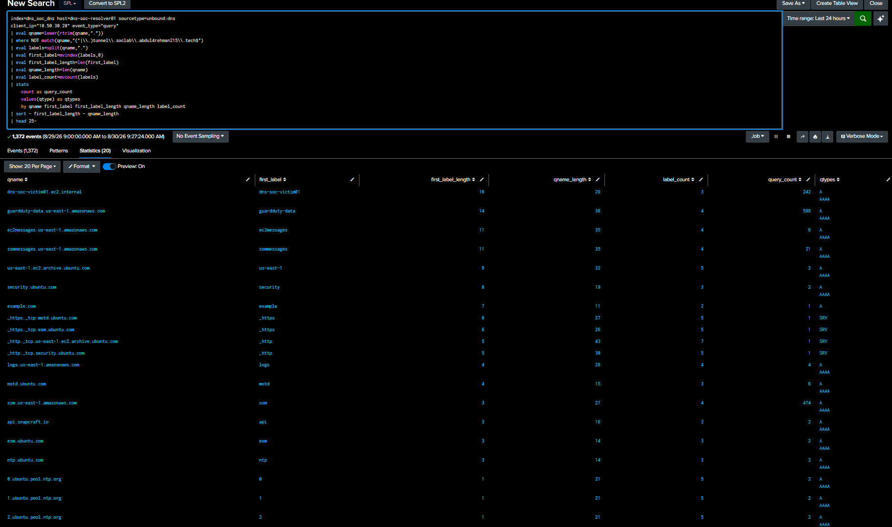
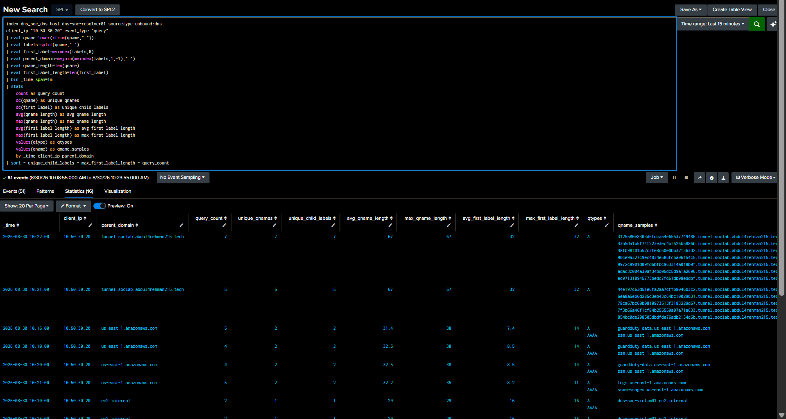
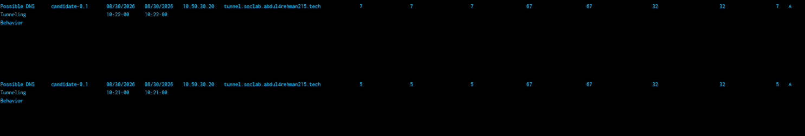
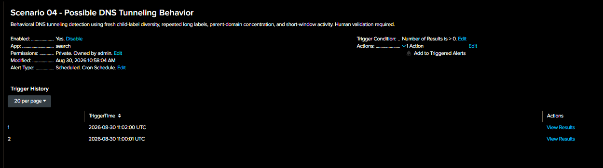

   

[🏠 Scenario Home](../README.md) · [📊 Dashboard](../dashboard/README.md) · [🔎 SPL](../spl/README.md) · [🤖 AI](../ai/README.md) · [🧾 Evidence](../evidence/README.md)

# 🧠 Scenario 04 Detection Engineering Workspace

Abdul-Rehman's engineering record starts with **live Unbound telemetry** and ends only after the baseline, feature hunt, Dashboard Studio investigation surface, controlled positive, benign lookalike challenge, frozen Detection v1.0, scheduled alert, raw-event drilldown and `dns_tunneling_v1` AI evidence contract all passed validation.

## 🚦 Engineering Snapshot

| Field | Final state |
|---|---|
| Engineer | [Abdul-Rehman](https://github.com/abdul4rehman215) |
| Primary telemetry | Unbound resolver query/reply evidence |
| MITRE | `T1071.004 — Application Layer Protocol: DNS` |
| `T1572` | **Not claimed** |
| Detection window | 1 minute |
| Unique child labels | `>= 5` |
| Long-label count | `>= 5` |
| Maximum first-label length | `> 16` |
| Positive challenge | ✅ Passed |
| Benign long-label lookalike | ✅ Did not trigger |
| Dashboard | ✅ Validated |
| Scheduled alert | ✅ Triggered |
| AI evidence contract | ✅ Validated |
| Production state | **Detection v1.0 frozen** |

## 🔁 Engineering Lifecycle

```mermaid
flowchart LR
    A["📡 Validate<br/>Resolver Fields"] --> B["⏱️ Measure<br/>Ingestion"]
    B --> C["📊 Clean<br/>Baseline"]
    C --> D["🧬 Engineer<br/>Label Features"]
    D --> E["🔎 Threshold-Free<br/>Hunting"]
    E --> F["📊 Dashboard<br/>Studio"]
    F --> G["✅ Positive<br/>Validation"]
    G --> H["🧪 Benign<br/>Challenge"]
    H --> I["🧊 Freeze<br/>v1.0"]
    I --> J["🚨 Scheduled<br/>Alert"]
    J --> K["🤖 AI<br/>Evidence Contract"]
    K --> L["🔎 SOC<br/>Investigation"]

    classDef data fill:#082f49,stroke:#22d3ee,color:#fff,stroke-width:2px;
    classDef eng fill:#0f3d3e,stroke:#14b8a6,color:#fff,stroke-width:2px;
    classDef ai fill:#3b0764,stroke:#a855f7,color:#fff,stroke-width:2px;
    classDef soc fill:#172554,stroke:#60a5fa,color:#fff,stroke-width:2px;
    class A,B,C data;
    class D,E,F,G,H,I,J eng;
    class K ai;
    class L soc;
```

## 🖼️ Engineering Evidence Highlights

<table>
<tr>
<td width="33%"> <b>Telemetry:</b> resolver fields and event semantics validated.</td>
<td width="33%"> <b>Feature hunt:</b> parent/child and first-label structure explored before thresholds.</td>
<td width="33%"> <b>Analyst surface:</b> Dashboard Studio built before the final alert was frozen.</td>
</tr>
<tr>
<td width="33%"> <b>Positive:</b> intended tunneling-like structure triggered.</td>
<td width="33%"> <b>False-positive challenge:</b> one repeated long label did not trigger v1.0.</td>
<td width="33%"> <b>Operationalization:</b> the production scheduled alert executed successfully.</td>
</tr>
</table>

## 🗂️ Start Here

| Artifact | Purpose |
|---|---|
| [`DETECTION-ENGINEERING.md`](DETECTION-ENGINEERING.md) | flagship 599-line engineering case study |
| [`detection-engineering-validation.md`](detection-engineering-validation.md) | acceptance matrix and proof |
| [`FREEZE-RECORD.md`](FREEZE-RECORD.md) | frozen v1.0 thresholds and change-control boundary |
| [`TROUBLESHOOTING-AND-LESSONS.md`](TROUBLESHOOTING-AND-LESSONS.md) | reusable engineering lessons |
| [`commands/README.md`](commands/README.md) | controlled validation command map |
| [`../spl/README.md`](../spl/README.md) | production SPL lifecycle |
| [`../dashboard/README.md`](../dashboard/README.md) | investigation dashboard |
| [`../ai/README.md`](../ai/README.md) | AI evidence contract |

> **Engineering principle:** do not detect “long DNS.” Detect a measured combination of fresh child-label structure, concentration and short-window behavior that survives a benign challenge.

[🏠 Scenario Home](../README.md) · [📖 Engineering Story](DETECTION-ENGINEERING.md) · [📊 Dashboard](../dashboard/README.md) · [🔎 SPL](../spl/README.md)

 

**Measure first. Challenge the hypothesis. Freeze only what survives.**

[⬆ Back to top](#top)

