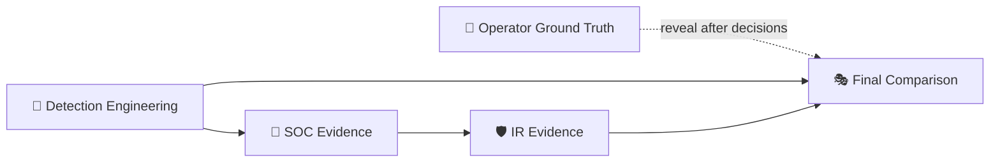
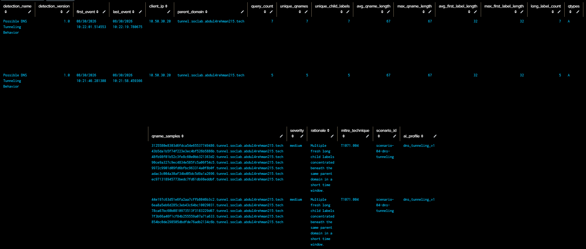
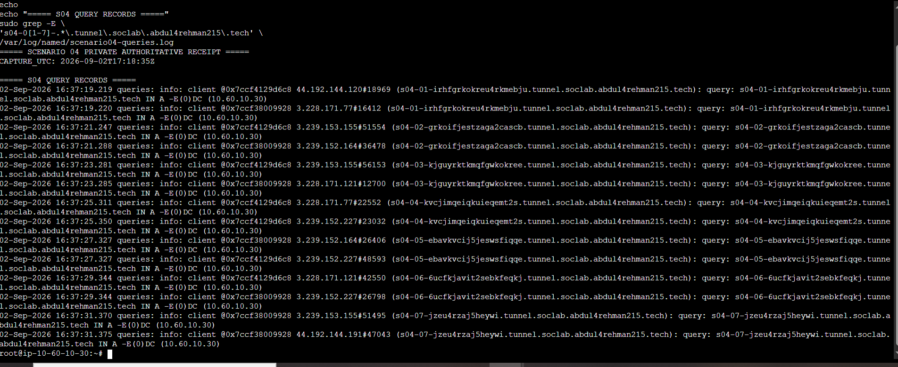
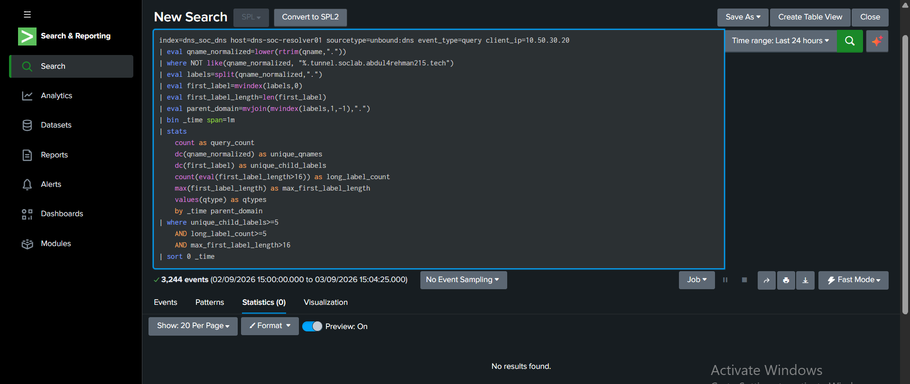
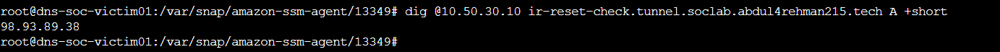

  

[🏠 Scenario Home](../README.md) · [🎯 Operator](../attacker/README.md) · [🔎 SOC](../soc/evidence/README.md) · [🛡️ IR](../ir/evidence/README.md)

# 🧾 Scenario 04 — Master Evidence Index

Detailed evidence stays with the role that produced it. This page connects the layers into one auditable chain without recreating the root 17-image gallery.

## 🔁 Evidence Architecture

## 🖼️ Cross-Role Highlights

<table>
<tr>
<td width="25%"> <b>Engineering:</b> frozen rule validated.</td>
<td width="25%"> <b>Operator:</b> seven qnames reached BIND.</td>
<td width="25%"> <b>SOC:</b> same-rule baseline challenge.</td>
<td width="25%"> <b>IR:</b> final safe-state DNS proof.</td>
</tr>
</table>

## 🧠 Detection Engineering

- [`../detection-engineering/detection-engineering-validation.md`](../detection-engineering/detection-engineering-validation.md)
- [`../screenshots/detection-engineering/`](../screenshots/detection-engineering/)
- [`detection-engineering/`](detection-engineering/)

## 🎯 Operator Ground Truth

- [`../attacker/PROJECT-LEAD-ADVERSARY.md`](../attacker/PROJECT-LEAD-ADVERSARY.md)
- [`../attacker/ground-truth.md`](../attacker/ground-truth.md)
- [`../screenshots/attacker/`](../screenshots/attacker/)

## 🔎 SOC Investigation

- [`../soc/evidence/README.md`](../soc/evidence/README.md)
- [`../soc/SOC-ANALYST-INVESTIGATION.md`](../soc/SOC-ANALYST-INVESTIGATION.md)
- [`../soc/SOC-TO-IR-HANDOFF.md`](../soc/SOC-TO-IR-HANDOFF.md)

## 🛡️ Incident Response

- [`../ir/evidence/README.md`](../ir/evidence/README.md)
- [`../ir/INCIDENT-RESPONSE.md`](../ir/INCIDENT-RESPONSE.md)
- [`../ir/IR-FINAL-REPORT.md`](../ir/IR-FINAL-REPORT.md)

## 🎭 Final Comparison

- [`../exercise/final-comparison.md`](../exercise/final-comparison.md)

> **Evidence rule:** a screenshot or export belongs in the public case only when it proves a claim, supports a decision or preserves a reusable root cause.

[🏠 Scenario Home](../README.md) · [🎭 Final Comparison](../exercise/final-comparison.md) · [🖼️ Screenshot Portal](../screenshots/README.md)

 

**Preserve the source. Explain the claim. Keep the evidence boundary visible.**

[⬆ Back to top](#top)

