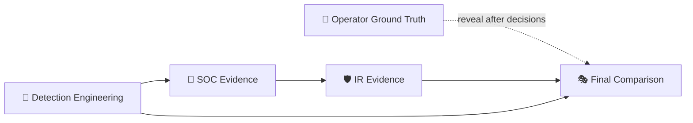

  

[🏠 Scenario Home](../README.md) · [🧬 Operator](../attacker/README.md) · [🔎 SOC](../soc/README.md) · [🛡️ IR](../ir/README.md)

# 🧾 Master Evidence Index

Detailed evidence stays with the role that produced it. This page links the layers into one auditable chain without creating one giant screenshot dump.

## Detection Engineering

- [`../detection-engineering/detection-engineering-validation.md`](../detection-engineering/detection-engineering-validation.md)
- [`../screenshots/detection-engineering/`](../screenshots/detection-engineering/)
- [`detection-engineering/resolver-field-validation-sample.csv`](detection-engineering/resolver-field-validation-sample.csv)
- [`detection-engineering/scheduled-alert-result.csv`](detection-engineering/scheduled-alert-result.csv)

## Operator / ground truth

- [`../attacker/PROJECT-LEAD-ADVERSARY.md`](../attacker/PROJECT-LEAD-ADVERSARY.md)
- [`../attacker/ground-truth.md`](../attacker/ground-truth.md)
- [`../attacker/scripts/scenario04-tunnel-client.py`](../attacker/scripts/scenario04-tunnel-client.py)
- [`../screenshots/attacker/`](../screenshots/attacker/)

## SOC

- [`../soc/evidence/README.md`](../soc/evidence/README.md)
- [`../soc/SOC-ANALYST-INVESTIGATION.md`](../soc/SOC-ANALYST-INVESTIGATION.md)
- [`../soc/SOC-TO-IR-HANDOFF.md`](../soc/SOC-TO-IR-HANDOFF.md)

## Incident Response

- [`../ir/evidence/README.md`](../ir/evidence/README.md)
- [`../ir/INCIDENT-RESPONSE.md`](../ir/INCIDENT-RESPONSE.md)
- [`../ir/IR-FINAL-REPORT.md`](../ir/IR-FINAL-REPORT.md)

## Final comparison

- [`../exercise/final-comparison.md`](../exercise/final-comparison.md)

## Evidence rule

A screenshot or export is present because it proves a claim, supports a decision, or documents a reusable root cause. Backend chat/progress screenshots, repeated navigation views and preservation-package housekeeping are not part of the public case narrative.
