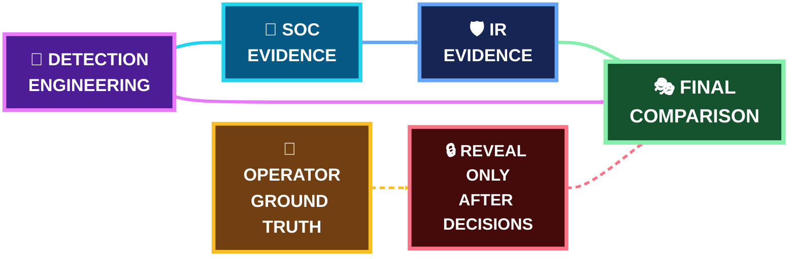

 

[🏠 Scenario Home](../README.md) · [🎬 Execution](../SCENARIO-04-EXECUTION.md) · [🎭 Final Comparison](final-comparison.md) · [🧾 Evidence](../evidence/README.md)

# 🎭 Scenario 04 — Exercise Control

The exercise was designed so each role could only claim what its evidence supported **at that stage**. Sonia's exact operator timing, synthetic source message, generated qname list and authoritative BIND ground truth stayed hidden until SOC and IR decisions were complete.

## 🔐 Information-Separation Model

## ✅ Exercise Gates

| Gate | Result |
|---|---|
| Detection Engineering frozen before official execution | ✅ |
| one finite operator session completed | ✅ |
| operator ground truth kept private from defenders | ✅ |
| SOC disposition locked before reveal | ✅ |
| IR validation/response completed independently | ✅ |
| human-approved RPZ response verified | ✅ |
| safe reset verified | ✅ |
| ground truth compared only after defender decisions | ✅ |

## 🗂️ Files

- [`REALISTIC-EXERCISE-PROTOCOL.md`](REALISTIC-EXERCISE-PROTOCOL.md) — exercise rules and information boundary
- [`final-comparison.md`](final-comparison.md) — operator ↔ authoritative DNS ↔ resolver ↔ detection ↔ AI ↔ SOC ↔ IR comparison

> **Why this matters:** the strongest learning comes from comparing what each role could prove before the reveal with what the final ground truth later showed.

[🏠 Scenario Home](../README.md) · [🎭 Final Comparison](final-comparison.md) · [🧾 Evidence](../evidence/README.md)

 

**Lock the decisions first. Reveal the ground truth second.**

[⬆ Back to top](#top)

