<a id="top"></a>


<div align="center">


[🏠 Scenario Home](../README.md) · [🛡️ Workspace](README.md) · [🧾 Evidence](../evidence/README.md)

</div>


# 🛡️ Incident Response / Defender — Musfira

Musfira's job was not to repeat the SOC report. She treated every handoff statement as a claim to reproduce, searched for the context SOC did not have, decided whether response was proportionate, and then proved the DNS control actually changed runtime behavior before restoring the resolver.

## 🔎 1. Start with the biggest SOC unknown: endpoint attribution

A direct Splunk search for `host=dns-soc-victim01` during the incident window returned no events.

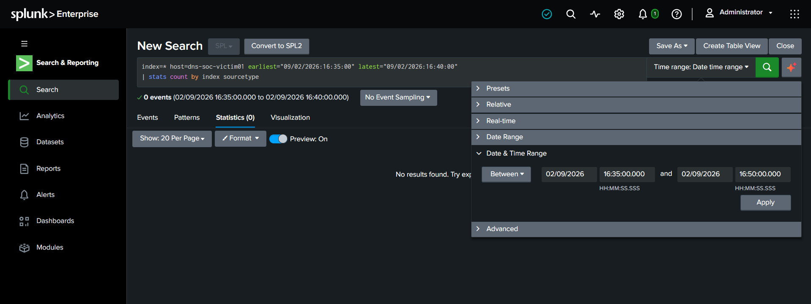

A broader source inventory confirmed DNS/AWS telemetry was available, but no victim endpoint host telemetry suitable for process/user attribution was present.

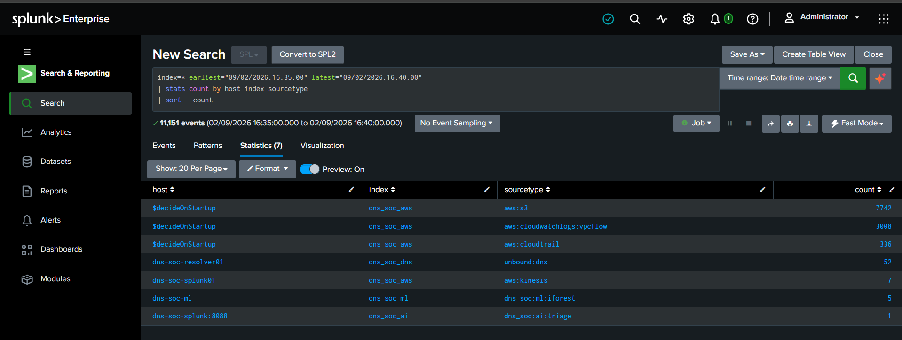

**IR conclusion:** originating process/user could not be established from the available Splunk data. This was documented as an evidence limitation, not filled with assumption.

## 📌 2. Independently reproduce the core DNS facts

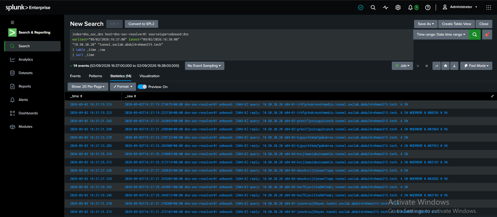

Musfira independently found:

```text
14 Unbound events
= 7 query rows
+ 7 reply rows
client: 10.50.30.20
parent: tunnel.soclab.abdul4rehman215.tech
window: ~16:37:19–16:37:31 UTC
replies: NOERROR
```

That independently validated the core SOC evidence.

## 🌐 3. Challenge network correlation instead of trusting timing

VPC Flow Logs showed outbound activity during and after the DNS burst.

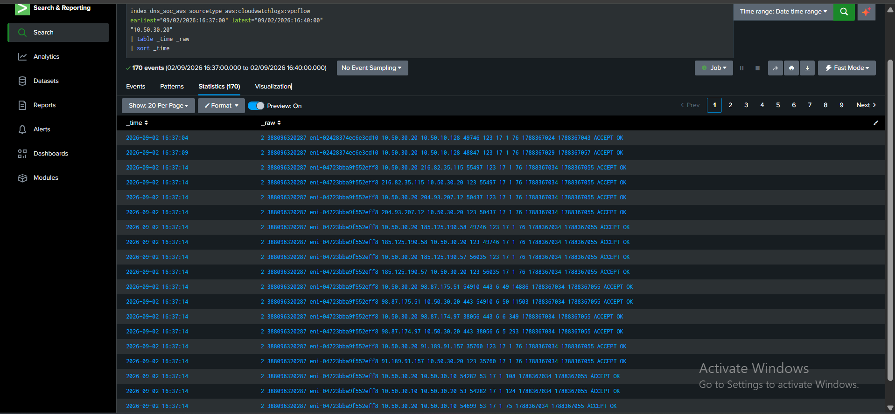

Seven outbound HTTPS flows appeared after the suspicious DNS queries.

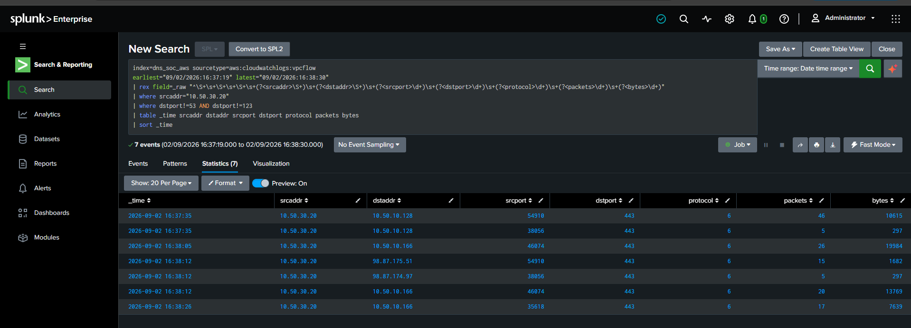

Temporal proximity was not enough. Musfira checked those same destinations **before** the burst.

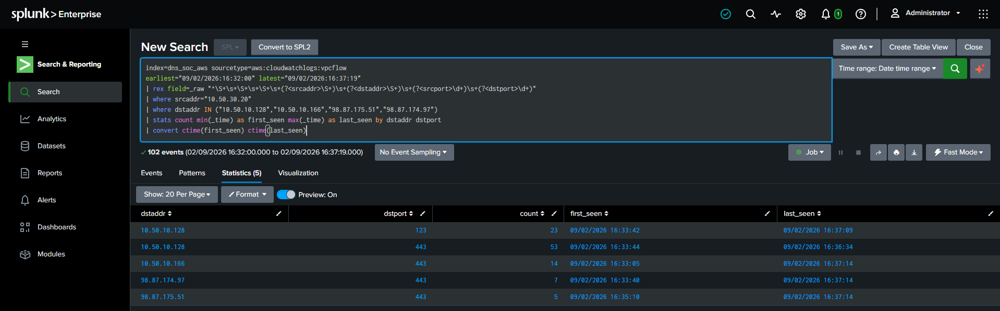

They were already active.

> **IR decision:** do not attribute the HTTPS traffic to the suspicious DNS event. Timing is not causation.

This is one of the strongest reasoning moments in the case.

## 📌 4. Narrow AWS change context

The broad CloudTrail search was noisy and mostly read-only. Filtering to write actions surfaced two `StartInstances` events before the burst.

IR preserved the context but did not turn routine authorized lab activity into evidence of compromise.

## 📌 5. Check recurrence

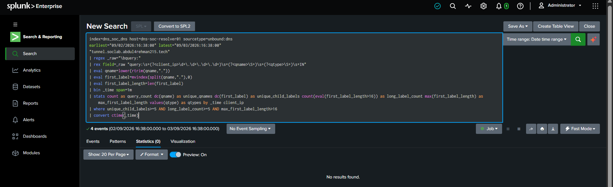

No later one-minute window reproduced the frozen combination of unique children, long-label count and maximum first-label length.

## 🛡️ 6. Inspect the response control before changing it

The existing RPZ was deliberately safe/non-enforcing before Incident Response.

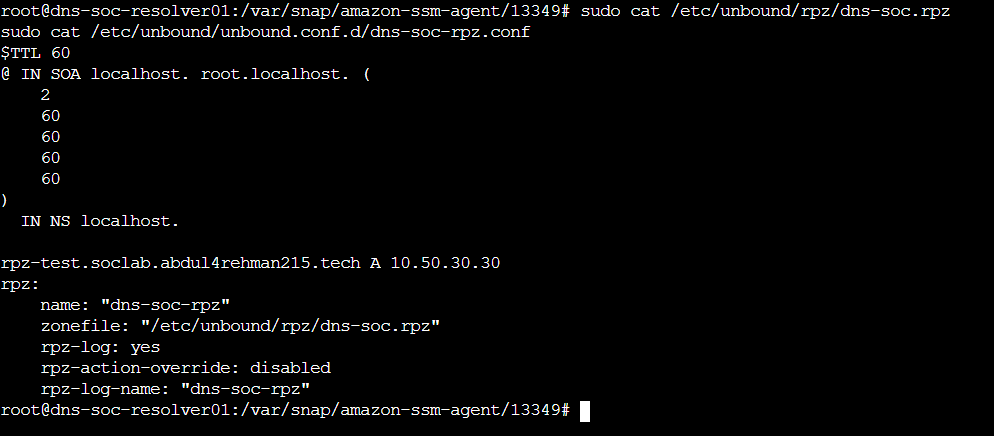

Backups were created before the temporary change.

Target response scope:

```text
*.tunnel.soclab.abdul4rehman215.tech
→ 10.50.30.30
```

The scope targeted the observed namespace, not the whole endpoint or all DNS.

## ✅ 7. Verify behavior, not just service state

The first activation attempt left Unbound active but did not change the victim answer.

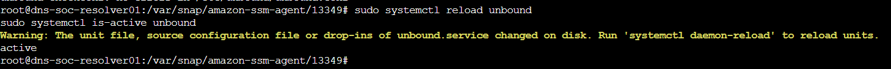

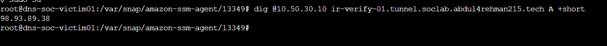

This prevented a false “containment succeeded” claim.

> **Lesson:** `systemctl active` is not proof that a security policy is effective.

## 🧩 8. Recover cleanly from a bad troubleshooting edit

A trailing-dot RPZ experiment caused an RPZ zone-scope parse error and temporarily made DNS unavailable.

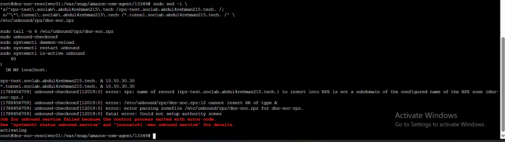

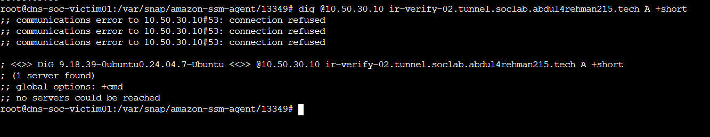

Because Musfira had backed up the exact pre-change files, the resolver was restored without improvising a replacement configuration.

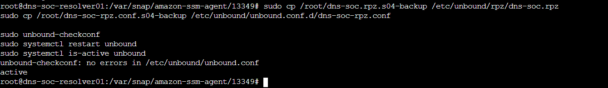

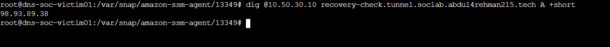

This is preserved as a reusable response-engineering lesson, not as a parade of failed commands.

## 🛡️ 9. Load the correct RPZ policy and prove it twice

The corrected no-trailing-dot wildcard passed `unbound-checkconf`. A daemon reload/restart then loaded the policy.

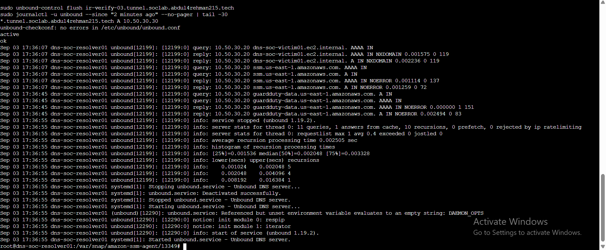

Victim-side proof:


```text
ir-verify-03.tunnel.soclab.abdul4rehman215.tech
→ 10.50.30.30
```

Defender-side proof:

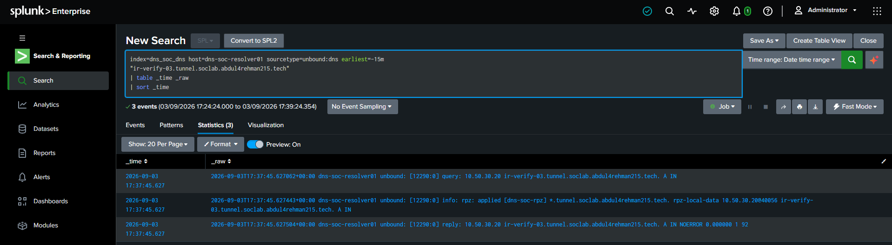

Splunk showed the query, the wildcard RPZ application, local-data `10.50.30.30`, and a successful response.

**Containment status: VALIDATED**

## 📌 10. Restore the safe state

Containment verification was not the end of the case. The original RPZ files were restored.

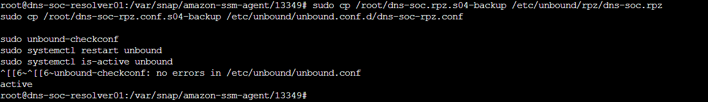

Victim-side DNS returned to the normal authoritative answer observed during the exercise:


**Reset status: SUCCESSFUL**

## 🏁 11. Final IR conclusion

After authorization context was established:

> **AUTHORIZED CONTROLLED EXERCISE ACTIVITY — NO REAL-WORLD COMPROMISE CLAIMED. CONTROLLED CONTAINMENT VALIDATED.**

IR independently confirmed the suspicious resolver-side pattern and the lack of endpoint attribution. No network flow was proven to be caused by the DNS burst, and the frozen behavior did not recur. The defender then demonstrated a scoped RPZ control, proved it from both victim and Splunk perspectives, and restored the resolver safely.

## 🧾 Evidence limitations

- No victim process/user telemetry was available for the suspicious window.
- DNS labels were not decoded by SOC/IR.
- Successful DNS replies do not prove payload transfer or exfiltration.
- Post-DNS HTTPS flows were not causally tied to the suspicious names.
- The public authoritative IPv4 was an exercise-time observation, not a permanent architecture constant.

## 📌 Responder reflection

Musfira's strongest work was not the final `10.50.30.30` answer. It was the discipline around that answer: **reproduce**, **challenge correlation**, **back up**, **verify**, **recover**, **re-apply correctly**, and **reset**. That is what turns a DNS policy change into a defensible Incident Response action.

---

[🏠 Scenario Home](../README.md) · [🧾 Final Report](IR-FINAL-REPORT.md) · [🕒 Timeline](TIMELINE.md) · [🧠 Lessons](LESSONS-LEARNED.md) · [⬆ Back to top](#top)


<div align="center">

[🏠 Scenario Home](../README.md) · [🛡️ Workspace](README.md) · 

**Structure before suspicion. Evidence before attribution. Human approval before containment.**

</div>


