   

[🏠 Scenario Home](../README.md) · [🔎 SOC Handoff](../soc/SOC-TO-IR-HANDOFF.md) · [🧾 Evidence](evidence/README.md) · [🎭 Comparison](../exercise/final-comparison.md)

# 🛡️ Scenario 04 Incident Response Workspace

Musfira treated the SOC handoff as **claims to validate**, not a verdict to repeat. IR rebuilt the DNS facts, challenged network causality, narrowed AWS context, checked recurrence, inspected the existing RPZ response control, executed a human-approved containment validation, recovered from a real configuration failure, proved the correct response twice and safely restored the resolver.

## 🚦 Response Snapshot

| Field | IR result |
|---|---|
| Responder | Musfira |
| SOC input | `INCONCLUSIVE — ESCALATION WARRANTED / High confidence` |
| Endpoint telemetry | direct victim host evidence unavailable |
| DNS behavior | independently confirmed |
| Resolver replies | **7 queries + 7 NOERROR** |
| Network causality | post-burst destinations also existed pre-burst |
| Recurrence | no second frozen-pattern detection window |
| Final exercise context | authorized DNSentinel training environment |
| IR result | **AUTHORIZED CONTROLLED EXERCISE ACTIVITY — CONTROLLED CONTAINMENT VALIDATED** |
| Response | wildcard RPZ |
| Sinkhole | `10.50.30.30` |
| Verification | victim answer + Splunk `rpz: applied` |
| Recovery | real bad-RPZ failure recovered cleanly |
| Safe reset | normal authoritative resolution restored |

## 🔁 Response Lifecycle

```mermaid
%%{init: {
  "theme": "base",
  "themeVariables": {
    "background": "#030712",
    "primaryTextColor": "#ffffff",
    "lineColor": "#f8fafc",
    "fontSize": "31px"
  },
  "flowchart": {
    "nodeSpacing": 48,
    "rankSpacing": 58,
    "curve": "basis",
    "padding": 20
  }
}}%%

flowchart TB

    %% =====================================================
    %% ROW 1 · VALIDATE + PREPARE
    %% =====================================================
    subgraph ROW1[" "]
        direction LR

        A["📨 01 · SOC<br/>HANDOFF"]

        B["🔎 02 · INDEPENDENT<br/>DNS VALIDATION"]

        C["🌐 03–04 · CAUSALITY<br/>Network Challenge<br/>+ AWS Context"]

        D["🔁 05–06 · PRECHECK<br/>Recurrence Check<br/>+ RPZ Precheck"]

        A ==> B ==> C ==> D
    end


    %% =====================================================
    %% ROW 2 · APPROVE + RESPOND + VERIFY
    %% =====================================================
    subgraph ROW2[" "]
        direction LR

        E["👤 07 · HUMAN<br/>APPROVAL"]

        F["⚙️ 08 · FIRST<br/>ACTIVATION"]

        G["🧩 09–10 · RECOVER<br/>Troubleshoot<br/>+ Correct RPZ"]

        H["✅ 11–12 · PROVE + RESET<br/>Victim + Splunk Proof<br/>+ Safe Reset"]

        E ==> F ==> G ==> H
    end


    %% =====================================================
    %% KEEP BOTH ROWS COMPACT
    %% =====================================================
    ROW1 ==> ROW2


    %% =====================================================
    %% PREMIUM GLOSSY COLORS
    %% =====================================================
    classDef handoff fill:#172554,stroke:#60a5fa,stroke-width:6px,color:#ffffff,font-size:31px,font-weight:bold;

    classDef dns fill:#075985,stroke:#22d3ee,stroke-width:6px,color:#ffffff,font-size:31px,font-weight:bold;

    classDef context fill:#312e81,stroke:#a78bfa,stroke-width:6px,color:#ffffff,font-size:31px,font-weight:bold;

    classDef precheck fill:#713f12,stroke:#fbbf24,stroke-width:6px,color:#ffffff,font-size:31px,font-weight:bold;

    classDef approval fill:#14532d,stroke:#4ade80,stroke-width:6px,color:#ffffff,font-size:31px,font-weight:bold;

    classDef activation fill:#4c1d95,stroke:#e879f9,stroke-width:6px,color:#ffffff,font-size:31px,font-weight:bold;

    classDef recover fill:#9a3412,stroke:#fb923c,stroke-width:6px,color:#ffffff,font-size:31px,font-weight:bold;

    classDef proof fill:#065f46,stroke:#86efac,stroke-width:7px,color:#ffffff,font-size:32px,font-weight:bold;


    %% =====================================================
    %% APPLY STYLES
    %% =====================================================
    class A handoff;
    class B dns;
    class C context;
    class D precheck;

    class E approval;
    class F activation;
    class G recover;
    class H proof;


    %% =====================================================
    %% GLOSSY ROW PANELS
    %% =====================================================
    style ROW1 fill:#06131d,stroke:#38bdf8,stroke-width:3px

    style ROW2 fill:#0b130d,stroke:#4ade80,stroke-width:3px


    %% =====================================================
    %% BRIGHT CONNECTORS
    %% =====================================================
    linkStyle default stroke:#f8fafc,stroke-width:6px;
```

## 🖼️ IR Evidence Highlights

<table>
<tr>
<td width="33%"> <b>E03:</b> seven-query/seven-NOERROR behavior independently reproduced.</td>
<td width="33%"> <b>E06:</b> post-burst HTTPS destinations already existed before the DNS burst.</td>
<td width="33%"> <b>E11:</b> response control started in a safe non-enforcing state.</td>
</tr>
<tr>
<td width="33%"> <b>E19:</b> corrected policy loaded after recovery.</td>
<td width="33%"> <b>E20:</b> victim received <code>10.50.30.30</code>.</td>
<td width="33%"> <b>E23:</b> normal authoritative resolution returned after reset.</td>
</tr>
</table>

## 🗂️ Start Here

- [`INCIDENT-RESPONSE.md`](INCIDENT-RESPONSE.md) — flagship response story
- [`IR-FINAL-REPORT.md`](IR-FINAL-REPORT.md) — formal closeout
- [`TIMELINE.md`](TIMELINE.md) — IR timeline
- [`LESSONS-LEARNED.md`](LESSONS-LEARNED.md) — response/recovery lessons
- [`IR-COMMAND-LEDGER.md`](IR-COMMAND-LEDGER.md) — clean search/action index
- [`spl/README.md`](spl/README.md) — independent validation search lifecycle
- [`shell/README.md`](shell/README.md) — RPZ/recovery/reset path
- [`evidence/README.md`](evidence/README.md) — E01–E23 evidence portal

> **Response success was not “the service restarted.”** It was victim proof + resolver proof + Splunk proof + safe reset.

[🏠 Scenario Home](../README.md) · [📖 IR Story](INCIDENT-RESPONSE.md) · [📋 Final Report](IR-FINAL-REPORT.md) · [🧾 Evidence](evidence/README.md)

 

**Validate independently. Change deliberately. Verify behavior. Restore safely.**

[⬆ Back to top](#top)

