 

[🏠 Scenario Home](../../README.md) · [🛡️ IR Workspace](../README.md) · [🧾 Evidence](../evidence/README.md)

# 💻 Scenario 04 — IR Response Commands

This folder preserves the **actual response lifecycle**, including the first activation path, recovery, corrected RPZ activation and safe reset.

```mermaid
flowchart LR
    A["🔐 Precheck / Backups"] --> B["🛡️ Stage Wildcard"]
    B --> C["⚙️ First Reload"]
    C --> D["🧪 Victim Test"]
    D --> E["🧩 Recover"]
    E --> F["✅ Victim Recovery Check"]
    F --> G["🎯 Correct RPZ Activation"]
    G --> H["🕳️ Victim Sinkhole Proof"]
    H --> I["♻️ Safe Reset"]
    I --> J["✅ Post-Reset Check"]
```

| Script | Purpose |
|---|---|
| [`01-rpz-precheck.sh`](01-rpz-precheck.sh) | preserve safe starting state/backups |
| [`02-rpz-stage-scenario04.sh`](02-rpz-stage-scenario04.sh) | stage Scenario 04 wildcard |
| [`03-initial-reload-attempt.sh`](03-initial-reload-attempt.sh) | first activation/reload path |
| [`04-victim-initial-containment-test.sh`](04-victim-initial-containment-test.sh) | verify whether the first attempt changed behavior |
| [`05-rpz-recovery.sh`](05-rpz-recovery.sh) | restore healthy resolver state after bad RPZ troubleshooting edit |
| [`06-victim-recovery-check.sh`](06-victim-recovery-check.sh) | prove normal DNS after recovery |
| [`07-rpz-correct-activation.sh`](07-rpz-correct-activation.sh) | load corrected policy |
| [`08-victim-containment-proof.sh`](08-victim-containment-proof.sh) | prove sinkhole answer from victim |
| [`09-rpz-safe-reset.sh`](09-rpz-safe-reset.sh) | restore default RPZ state |
| [`10-victim-safe-reset-check.sh`](10-victim-safe-reset-check.sh) | prove normal DNS after reset |

> The failed trailing-dot edit is intentionally **not** preserved as a runnable command file. It is documented in [`../LESSONS-LEARNED.md`](../LESSONS-LEARNED.md) and evidence E15–E18.

> **Response principle:** service state is not enough. Validate actual DNS behavior after every change.

[🛡️ IR Workspace](../README.md) · [💻 Command Ledger](../IR-COMMAND-LEDGER.md) · [🧾 Evidence](../evidence/README.md)

 

**Recovery evidence belongs in the story because real response work is not always linear.**

[⬆ Back to top](#top)

