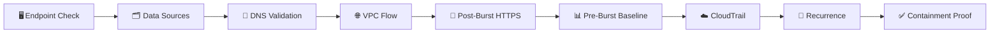

[🏠 Scenario Home](../../README.md) · [🛡️ IR Workspace](../README.md) · [💻 Command Ledger](../IR-COMMAND-LEDGER.md)

# 🔎 Scenario 04 — IR SPL Lifecycle

These searches support **independent validation** of the SOC handoff, network/change context, recurrence and containment proof.

| Search | Purpose |
|---|---|
| [`01-endpoint-host-telemetry-check.spl`](01-endpoint-host-telemetry-check.spl) | determine whether direct victim endpoint evidence exists |
| [`02-data-source-inventory.spl`](02-data-source-inventory.spl) | inventory defender data available to IR |
| [`03-independent-dns-validation.spl`](03-independent-dns-validation.spl) | independently reconstruct Scenario 04 DNS query/reply facts |
| [`04-vpc-flow-victim-window.spl`](04-vpc-flow-victim-window.spl) | inspect victim network activity around the event |
| [`05-post-burst-outbound-https.spl`](05-post-burst-outbound-https.spl) | identify post-burst HTTPS destinations |
| [`06-preburst-destination-baseline.spl`](06-preburst-destination-baseline.spl) | test whether those destinations predated the burst |
| [`07-cloudtrail-broad-context.spl`](07-cloudtrail-broad-context.spl) | broad AWS change context |
| [`08-cloudtrail-write-actions.spl`](08-cloudtrail-write-actions.spl) | narrow to write/change events |
| [`09-started-instance-ids.spl`](09-started-instance-ids.spl) | retrieve instance IDs for optional mapping |
| [`10-recurrence-validation.spl`](10-recurrence-validation.spl) | test for later frozen-pattern recurrence |
| [`11-containment-verification.spl`](11-containment-verification.spl) | verify RPZ response evidence in Splunk |

See [`../IR-COMMAND-LEDGER.md`](../IR-COMMAND-LEDGER.md) for the clean action/search index.

> **Boundary:** IR strengthened the case with defender evidence; it did not silently import the operator's private ground truth.

[🛡️ IR Workspace](../README.md) · [💻 Command Ledger](../IR-COMMAND-LEDGER.md) · [🧾 Evidence](../evidence/README.md)

 

**Independent validation is what turns a handoff into an IR conclusion.**

[⬆ Back to top](#top)

