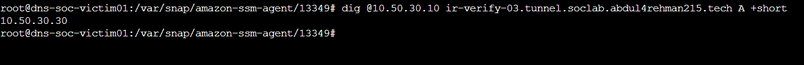

 

[🏠 Scenario Home](../README.md) · [🧾 Evidence Center](../evidence/README.md) · [🔎 SOC Evidence](../soc/evidence/README.md) · [🛡️ IR Evidence](../ir/evidence/README.md)

# 🖼️ Scenario 04 Visual Evidence

Evidence remains organized by the role or engineering stage that produced it.

| Role / workspace | Location | What it preserves |
|---|---|---|
| 🧠 Detection Engineering | [`detection-engineering/`](detection-engineering/) | baseline, feature hunt, dashboard, validation, alert and AI integration |
| 🎯 Operator / Project Lead | [`attacker/`](attacker/) | one-time client execution, resolver path, authoritative receipt and ground truth |
| 🔎 SOC Analyst | [`../soc/evidence/`](../soc/evidence/) | telemetry, labels, baseline, scope, AI validation |
| 🛡️ Incident Response | [`../ir/evidence/`](../ir/evidence/) | independent validation, causality, RPZ, recovery, containment and reset |

<table>
<tr>
<td width="50%"> <b>Engineering:</b> analyst-facing DNS tunneling investigation surface.</td>
<td width="50%"> <b>Response:</b> victim-side containment proof.</td>
</tr>
</table>

## 🎯 Operator Evidence Set

| File | What it proves |
|---|---|
| [`attacker/01-official-tunnel-client-execution.png`](attacker/01-official-tunnel-client-execution.png) | seven-query finite client executed from victim |
| [`attacker/02-victim-resolver-path.png`](attacker/02-victim-resolver-path.png) | victim remained on defender resolver |
| [`attacker/03-authoritative-host-confirmation.png`](attacker/03-authoritative-host-confirmation.png) | correct BIND EC2 identified |
| [`attacker/04-rpz-preflight-safe.png`](attacker/04-rpz-preflight-safe.png) | containment not active before run |
| [`attacker/05-authoritative-receipt.png`](attacker/05-authoritative-receipt.png) | seven generated qnames reached BIND |
| [`attacker/06-ground-truth-closeout.png`](attacker/06-ground-truth-closeout.png) | one-run deviation/timeline preserved |

## 📌 Presentation Rule

> **A screenshot should answer a technical question.**

The root README and role landing pages use only the strongest images. The complete evidence remains available through the role evidence indexes.

[🏠 Scenario Home](../README.md) · [🧾 Evidence Center](../evidence/README.md) · [🔎 SOC Evidence](../soc/evidence/README.md) · [🛡️ IR Evidence](../ir/evidence/README.md)

 

**Visual proof supports reasoning; it does not replace it.**

[⬆ Back to top](#top)

