  

[🏠 Scenario Home](../README.md) · [🧠 Detection](../detection-engineering/README.md) · [🧾 Evidence](evidence/README.md) · [🛡️ IR](../ir/README.md)

# 🔎 Scenario 04 SOC Workspace

Lubaba investigated the official alert from **defender-visible evidence only**. Private operator timing, source message, exact generated qname list and authoritative BIND ground truth remained hidden until after the SOC and IR decisions were locked.

## 🚦 Case Snapshot

| Field | SOC result |
|---|---|
| Analyst | Lubaba |
| Resolver-visible client | `10.50.30.20` |
| DNS queries | **7** |
| Unique qnames | **7** |
| Unique child labels | **7** |
| Long-label count | **7** |
| Maximum first-label length | **27** |
| Resolver replies | **7 / 7 NOERROR** |
| Same-rule baseline outside Scenario 04 | **0 matches** |
| AI validation | **CORRECT**, human validation preserved |
| Tunneling-like structure confidence | **High** |
| Malware / compromise / exfiltration attribution | **Not established** |
| Final disposition | **INCONCLUSIVE — ESCALATION WARRANTED** |

> **Confidence: High** refers to the observed tunneling-like DNS structure and case reconstruction, not to malware, compromise, attacker identity or unauthorized intent.

## 🔁 Investigation Path

```mermaid
%%{init: {
  "theme": "base",
  "themeVariables": {
    "background": "#030712",
    "primaryTextColor": "#ffffff",
    "lineColor": "#f8fafc",
    "fontSize": "31px"
  },
  "flowchart": {
    "nodeSpacing": 48,
    "rankSpacing": 58,
    "curve": "basis",
    "padding": 20
  }
}}%%

flowchart TB

    %% =====================================================
    %% ROW 1 · EVIDENCE FOUNDATION
    %% =====================================================
    subgraph ROW1[" "]
        direction LR

        A["📡 01 · TELEMETRY<br/>READINESS"]

        B["🔍 02 · NAMESPACE<br/>NORMALIZATION"]

        C["🧬 03 · RAW LABEL<br/>STRUCTURE"]

        D["🧠 04 · REPRODUCE<br/>DETECTION v1.0"]

        A ==> B ==> C ==> D
    end


    %% =====================================================
    %% ROW 2 · ANALYSIS + DECISION
    %% =====================================================
    subgraph ROW2[" "]
        direction LR

        E["📨 05–06 · CONTEXT<br/>Query / Reply<br/>+ Baseline"]

        F["🎯 07–08 · SCOPE<br/>+ Human Hypothesis"]

        G["🤖 09–10 · VALIDATE<br/>AI Challenge + 5W1H"]

        H["📨 11 · IR<br/>HANDOFF"]

        E ==> F ==> G ==> H
    end


    %% =====================================================
    %% ROW HANDOFF
    %% =====================================================
    ROW1 ==> ROW2


    %% =====================================================
    %% PREMIUM GLOSSY COLORS
    %% =====================================================
    classDef telemetry fill:#082f49,stroke:#22d3ee,stroke-width:6px,color:#ffffff,font-size:31px,font-weight:bold;

    classDef namespace fill:#075985,stroke:#38bdf8,stroke-width:6px,color:#ffffff,font-size:31px,font-weight:bold;

    classDef structure fill:#312e81,stroke:#818cf8,stroke-width:6px,color:#ffffff,font-size:31px,font-weight:bold;

    classDef detection fill:#4c1d95,stroke:#e879f9,stroke-width:7px,color:#ffffff,font-size:31px,font-weight:bold;

    classDef context fill:#0f766e,stroke:#5eead4,stroke-width:6px,color:#ffffff,font-size:31px,font-weight:bold;

    classDef scope fill:#713f12,stroke:#fbbf24,stroke-width:6px,color:#ffffff,font-size:31px,font-weight:bold;

    classDef validate fill:#7c2d12,stroke:#fb923c,stroke-width:6px,color:#ffffff,font-size:31px,font-weight:bold;

    classDef handoff fill:#14532d,stroke:#86efac,stroke-width:7px,color:#ffffff,font-size:33px,font-weight:bold;


    %% =====================================================
    %% APPLY STYLES
    %% =====================================================
    class A telemetry;
    class B namespace;
    class C structure;
    class D detection;

    class E context;
    class F scope;
    class G validate;
    class H handoff;


    %% =====================================================
    %% GLOSSY ROW PANELS
    %% =====================================================
    style ROW1 fill:#06131d,stroke:#38bdf8,stroke-width:3px

    style ROW2 fill:#0d1117,stroke:#4ade80,stroke-width:3px


    %% =====================================================
    %% BRIGHT CONNECTORS
    %% =====================================================
    linkStyle default stroke:#f8fafc,stroke-width:6px;
```

## 🖼️ SOC Evidence Highlights

<table>
<tr>
<td width="33%"> <b>E03:</b> normalized Scenario 04 namespace became visible.</td>
<td width="33%"> <b>E05:</b> exact child-label structure and lengths.</td>
<td width="33%"> <b>E07:</b> production alert actually fired.</td>
</tr>
<tr>
<td width="33%"> <b>E14:</b> same rule produced zero non-Scenario-04 matches.</td>
<td width="33%"> <b>E15:</b> one resolver-visible client remained in scope.</td>
<td width="33%"> <b>E18:</b> human validation of AI remained explicit.</td>
</tr>
</table>

## 🗂️ Start Here

- [`SOC-ANALYST-INVESTIGATION.md`](SOC-ANALYST-INVESTIGATION.md) — flagship investigation
- [`SOC-ANALYST-PLAYBOOK.md`](SOC-ANALYST-PLAYBOOK.md) — reusable DNS tunneling investigation method
- [`INVESTIGATION-TIMELINE.md`](INVESTIGATION-TIMELINE.md) — UTC sequence
- [`5W1H.md`](5W1H.md) — structured case record
- [`AI-VALIDATION.md`](AI-VALIDATION.md) — human-first AI review
- [`SOC-TO-IR-HANDOFF.md`](SOC-TO-IR-HANDOFF.md) — evidence-limited handoff
- [`SPL-QUERY-INDEX.md`](SPL-QUERY-INDEX.md) — query map
- [`spl/README.md`](spl/README.md) — visual investigation lifecycle
- [`evidence/README.md`](evidence/README.md) — curated E01–E19b evidence

> **SOC success here was restraint:** prove the DNS behavior, challenge baseline, preserve what the telemetry cannot attribute, and escalate the unanswered questions.

[🏠 Scenario Home](../README.md) · [📖 Full Investigation](SOC-ANALYST-INVESTIGATION.md) · [📨 IR Handoff](SOC-TO-IR-HANDOFF.md) · [🧾 Evidence](evidence/README.md)

 

**Prove the behavior. Preserve the limits. Escalate only what stronger evidence must answer.**

[⬆ Back to top](#top)

