<a id="top"></a>


<div align="center">


[🏠 Scenario Home](../README.md) · [🔎 Workspace](README.md) · [🧾 Evidence](../evidence/README.md)

</div>


# 🔎 SOC Analyst Investigation — Lubaba

Lubaba's task was not to prove the exercise was malicious. Her task was to determine what the defender-visible evidence actually proved, challenge the alert against normal DNS behavior, use AI only as a second opinion, and escalate with explicit attribution limits.

## 📡 1. Start by proving the telemetry is trustworthy

The reviewed 24-hour period contained **6,433 Unbound events** and current query/reply rows.

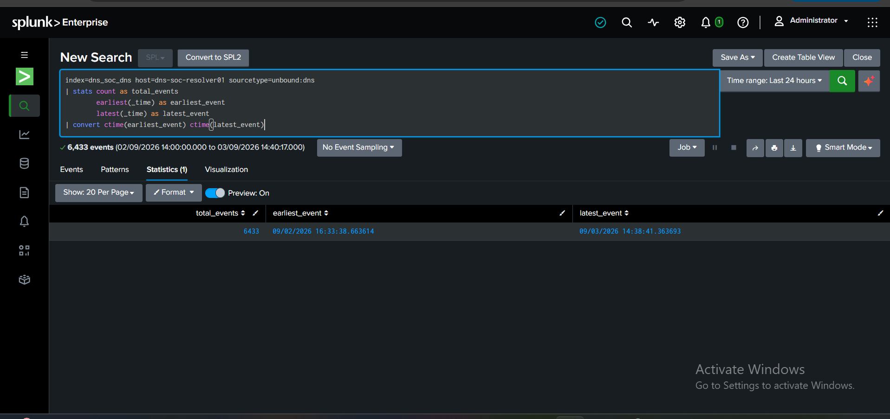

*What this proves: investigation began from a healthy resolver evidence source rather than from an alert assumption.*

Primary telemetry:

```text
index=dns_soc_dns
host=dns-soc-resolver01
sourcetype=unbound:dns
```

## 📌 2. Normalize DNS before deciding the data is missing

The first namespace search returned zero results even though telemetry was healthy. Raw qnames used fully-qualified trailing dots, so Lubaba normalized them before filtering.

```spl
| eval qname_normalized=lower(rtrim(qname,"."))
```

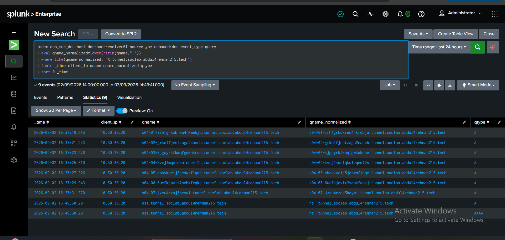

**Lesson:** protocol formatting can look like telemetry failure if fields are filtered too literally.

## 📌 3. Inspect the exact DNS structure

The raw qname table exposed the distinctive sequence:

```text
s04-01-...
s04-02-...
...
s04-07-...
```

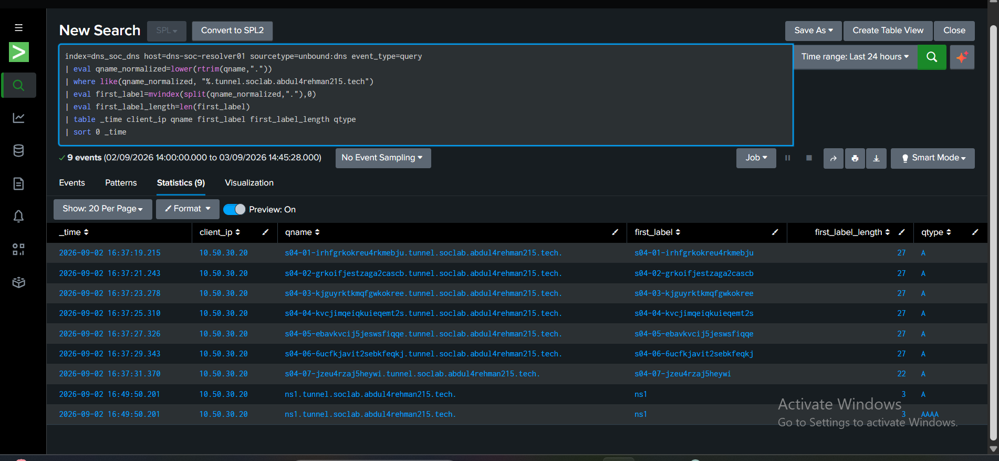

The first six labels measured 27 characters and the seventh measured 22.

Lubaba did **not** decode the labels or infer payload contents. The structural pattern was enough to justify further investigation.

## 🧠 4. Reproduce Detection v1.0 at the production time scale

The 24-hour namespace aggregate was not used as proof of a one-minute detection. Lubaba binned the data into one-minute windows and reapplied the frozen logic exactly.

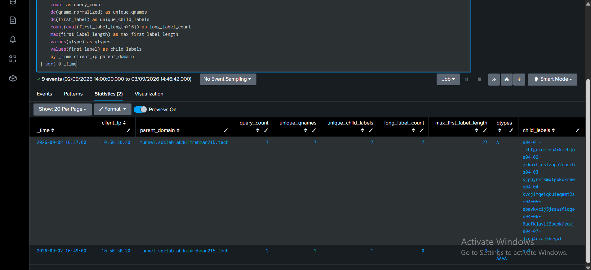

Official suspicious window:

| Metric | Value |
|---|---:|
| Query count | 7 |
| Unique qnames | 7 |
| Unique child labels | 7 |
| Long-label count | 7 |
| Maximum first-label length | 27 |
| Query type | A |

```text
unique_child_labels >= 5    → 7  PASS
long_label_count >= 5       → 7  PASS
max_first_label_length > 16 → 27 PASS
```

**FACT:** raw query telemetry independently reproduced the frozen detection behavior.

## 🚨 5. Validate the production alert instead of trusting it blindly

The official scheduled alert triggered at:

```text
2026-09-02 16:39:01 UTC
```

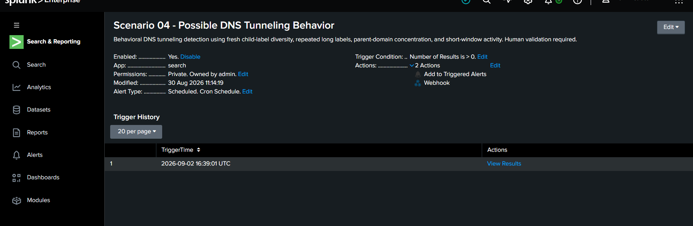

The saved alert result contained the same client, parent and core metrics as the independently reproduced raw window.

**FACT:** the production alert represented the actual defender-visible behavior accurately.

## 🔎 6. Separate query and reply semantics

Unbound records query and reply events separately. Counting both would have turned seven DNS requests into fourteen apparent events.

Lubaba counted behavior with `event_type=query` and used replies separately for response context.

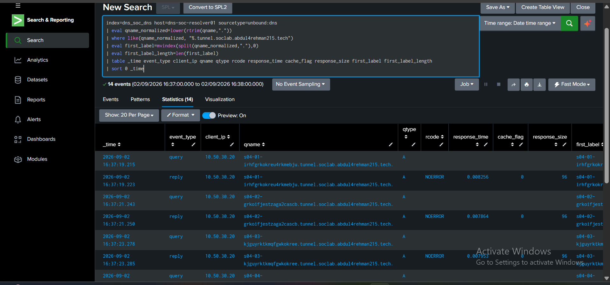

Reply result:

```text
7 replies
7 unique qnames
A
NOERROR
cache_flag=0
response size ≈ 91–96 bytes
```

NXDOMAIN was **not** part of this official suspicious burst.

## 🕒 7. Build the UTC case timeline

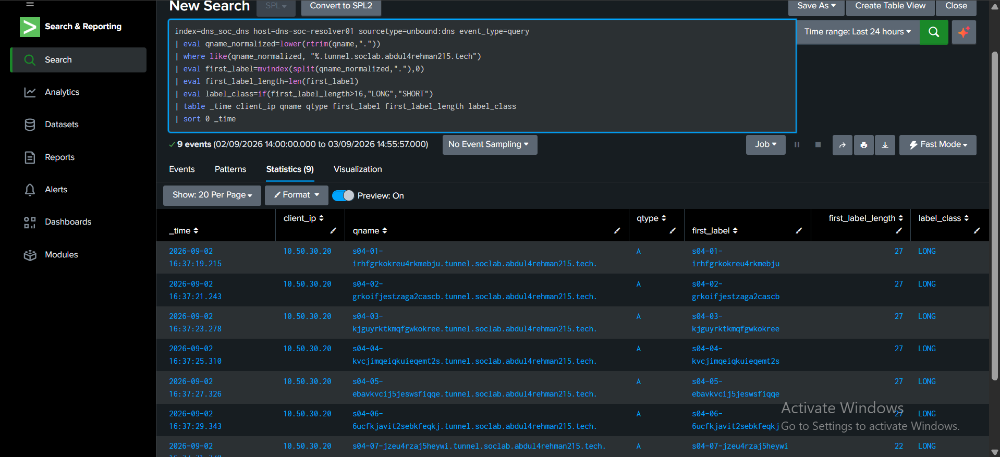

| UTC | Event |
|---|---|
| `16:37:19.215675` | First suspicious A query |
| `16:37:31.370200` | Last query in seven-query burst |
| `16:39:01` | Official alert trigger |
| `16:39:21.727239` | AI result processed |
| `16:49:50.201643` | Later `ns1.tunnel...` A/AAAA activity; structurally different |

No second one-minute window in the reviewed period reproduced the same frozen pattern.

## 📌 8. Challenge the obvious false-positive hypothesis

Long labels existed in normal traffic. Excluding Scenario 04 namespace activity, the same client produced:

```text
3,236 normal query rows
56 unique qnames
average first-label length ≈ 10.3
95th percentile = 16
maximum = 38
16 normal long-label queries (>16)
```

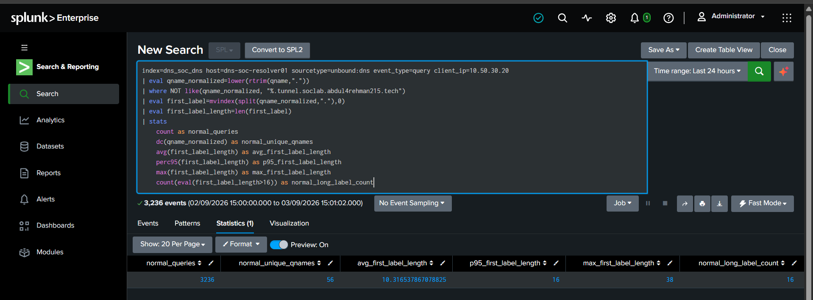

Normal long-label activity mainly involved AWS service names and low child diversity.

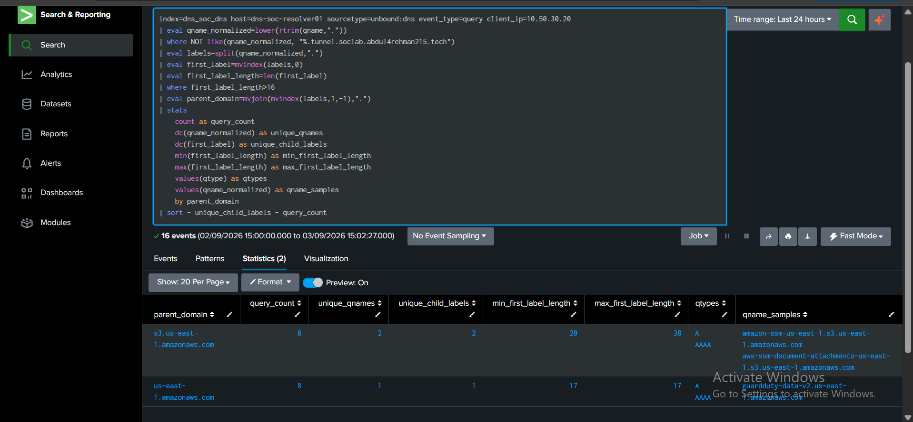

When the **full frozen rule** was applied to non-Scenario-04 traffic, it returned zero rows.


This is the core false-positive lesson:

```text
long DNS label alone ≠ tunneling
```

The useful signal was the combination of fresh-child diversity, multiple long labels, same-parent concentration and short-window timing.

## 🎯 9. Scope the behavior before escalating

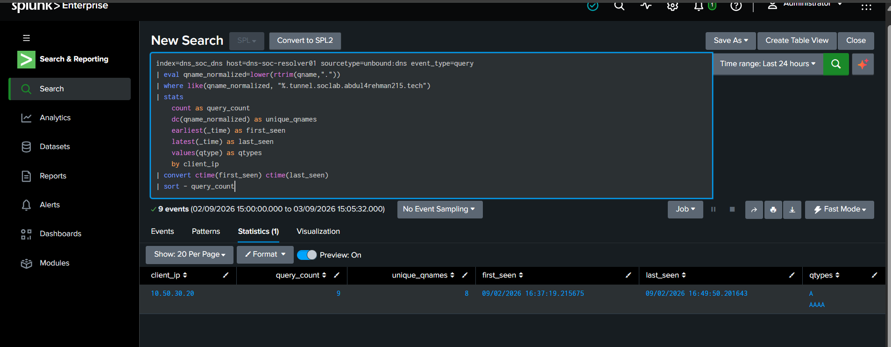

The suspicious pattern was limited to:

- resolver-visible client `10.50.30.20`;
- one parent `tunnel.soclab.abdul4rehman215.tech`;
- one matching one-minute window.

Environment-wide application of the same rule found no second client/parent match.

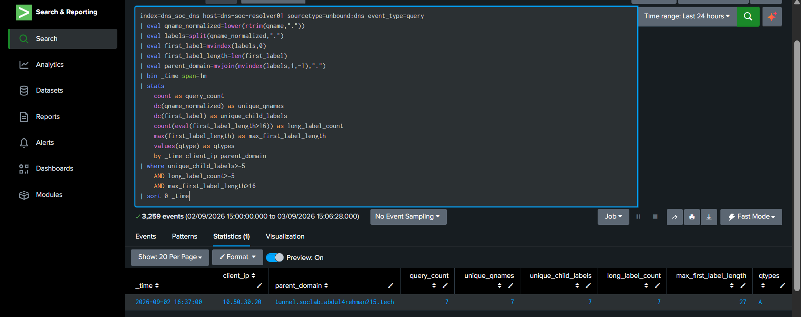

## 🤖 10. Form the human hypothesis before AI

Before opening the AI result, Lubaba documented:

> The observed DNS activity is genuinely anomalous and strongly resembles DNS tunneling-style structured DNS behavior. The alert is supported by raw resolver evidence and differs materially from the measured baseline. Available defender telemetry does not establish the originating process, payload contents, malware, compromise, data exfiltration, attacker identity, or whether the activity was authorized.

Pre-AI disposition:

> **INCONCLUSIVE — ESCALATION WARRANTED / High confidence**

That order prevented AI from becoming the source of the analyst's conclusion.

## 🤖 11. Validate AI claim by claim

The official AI event preserved:

```text
scenario_id = scenario-04-dns-tunneling
ai_profile  = dns_tunneling_v1
human_validation_required = true
```

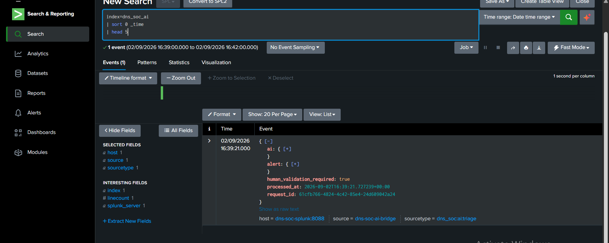

The AI correctly described the client, parent, seven A queries, unique-child count, time span, label-length evidence and T1071.004 context. It also correctly stopped short of claiming proven malicious intent, malware or successful transfer.

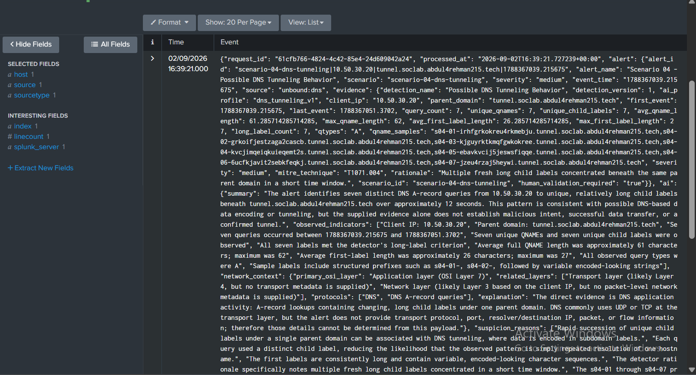

The AI noted that response context was not present in the alert evidence supplied to it. Lubaba had already filled that gap independently through raw Unbound reply analysis.

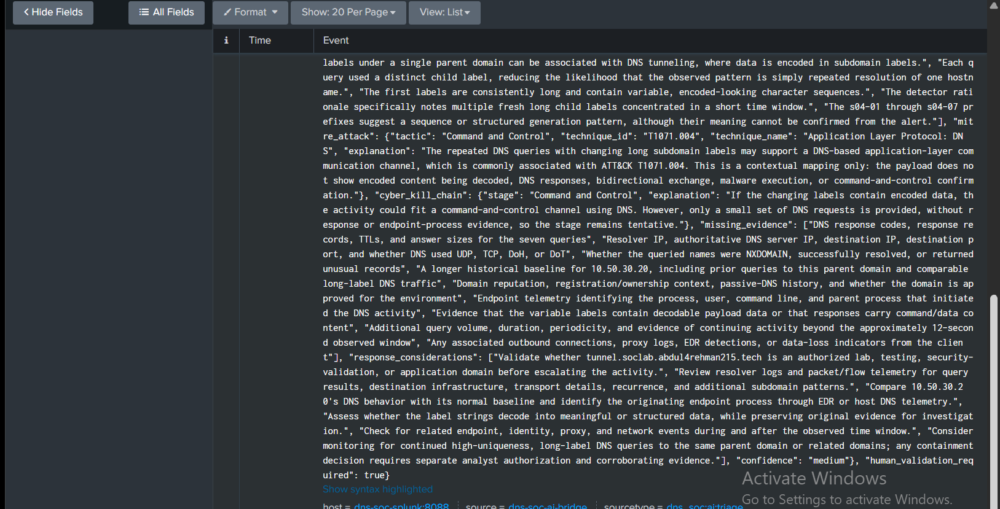

**AI validation result: CORRECT**

## 🧭 12. Lock 5W1H and disposition

The completed 5W1H is preserved in [`5W1H.md`](5W1H.md).

Final SOC disposition:

> ## **INCONCLUSIVE — ESCALATION WARRANTED**
> **Confidence: High**

The behavior was real, reproducible, isolated and materially different from baseline. But available defender telemetry did not establish:

- originating process;
- user identity;
- malware;
- compromise;
- payload contents;
- successful data transfer / exfiltration;
- attacker identity;
- malicious intent;
- authorization status.

This is why escalation was the correct SOC decision rather than a forced malicious/benign verdict.

## 📨 13. Handoff to IR

Lubaba handed Musfira a defender-only case record containing the alert, timeline, DNS metrics, baseline comparison, scope, AI validation, MITRE mapping, 5W1H, disposition and unanswered questions—without operator ground truth.

**[Read the SOC → IR handoff →](SOC-TO-IR-HANDOFF.md)**

## 📌 Analyst reflection

The strongest part of this investigation was not finding seven suspicious names. It was preserving the boundary between **what DNS proved** and **what DNS could not prove**. Lubaba normalized protocol data, reconstructed the detector, challenged false positives, scoped the case, checked AI against evidence and escalated only the questions that remained genuinely unanswered.

---

[🏠 Scenario Home](../README.md) · [📋 Playbook](SOC-ANALYST-PLAYBOOK.md) · [🕒 Timeline](INVESTIGATION-TIMELINE.md) · [🛡️ IR Handoff](SOC-TO-IR-HANDOFF.md) · [⬆ Back to top](#top)


<div align="center">

[🏠 Scenario Home](../README.md) · [🔎 Workspace](README.md) · 

**Structure before suspicion. Evidence before attribution. Human approval before containment.**

</div>


