[🏠 Scenario Home](../../README.md) · [🔎 SOC Workspace](../README.md) · [📘 Query Index](../SPL-QUERY-INDEX.md)

# 🔎 Scenario 04 — SOC Investigation SPL

These are the actual defender-side pivots used during the official SOC case. They remain separate from frozen Detection Engineering SPL so the repository preserves the difference between **building the detector** and **investigating an incident**.

```mermaid
%%{init: {
  "theme": "base",
  "themeVariables": {
    "background": "#030712",
    "primaryTextColor": "#ffffff",
    "lineColor": "#f8fafc",
    "fontSize": "31px"
  },
  "flowchart": {
    "nodeSpacing": 48,
    "rankSpacing": 58,
    "curve": "basis",
    "padding": 20
  }
}}%%

flowchart TB

    %% =====================================================
    %% ROW 1 · EVIDENCE FOUNDATION
    %% =====================================================
    subgraph ROW1[" "]
        direction LR

        A["🩺 01 · TELEMETRY<br/>READINESS"]

        B["🔍 02 · NAMESPACE<br/>NORMALIZATION"]

        C["🧬 03 · LABEL<br/>STRUCTURE"]

        D["🧠 04 · DETECTION<br/>v1.0 REPRODUCTION"]

        A ==> B ==> C ==> D
    end


    %% =====================================================
    %% ROW 2 · ANALYSIS + ESCALATION
    %% =====================================================
    subgraph ROW2[" "]
        direction LR

        E["📨 05–06 · DNS CONTEXT<br/>Query / Reply<br/>+ Baseline"]

        F["🎯 07 · INVESTIGATION<br/>SCOPE"]

        G["🤖 08 · AI<br/>VALIDATION"]

        H["📨 09 · IR<br/>HANDOFF"]

        E ==> F ==> G ==> H
    end


    %% =====================================================
    %% ROW HANDOFF
    %% =====================================================
    ROW1 ==> ROW2


    %% =====================================================
    %% PREMIUM GLOSSY COLORS
    %% =====================================================
    classDef telemetry fill:#075985,stroke:#22d3ee,stroke-width:6px,color:#ffffff,font-size:31px,font-weight:bold;

    classDef namespace fill:#172554,stroke:#60a5fa,stroke-width:6px,color:#ffffff,font-size:31px,font-weight:bold;

    classDef labels fill:#312e81,stroke:#818cf8,stroke-width:6px,color:#ffffff,font-size:31px,font-weight:bold;

    classDef detection fill:#4c1d95,stroke:#e879f9,stroke-width:7px,color:#ffffff,font-size:31px,font-weight:bold;

    classDef context fill:#0f766e,stroke:#5eead4,stroke-width:6px,color:#ffffff,font-size:31px,font-weight:bold;

    classDef scope fill:#713f12,stroke:#fbbf24,stroke-width:6px,color:#ffffff,font-size:31px,font-weight:bold;

    classDef ai fill:#7e22ce,stroke:#f0abfc,stroke-width:6px,color:#ffffff,font-size:31px,font-weight:bold;

    classDef handoff fill:#14532d,stroke:#86efac,stroke-width:7px,color:#ffffff,font-size:33px,font-weight:bold;


    %% =====================================================
    %% APPLY STYLES
    %% =====================================================
    class A telemetry;
    class B namespace;
    class C labels;
    class D detection;

    class E context;
    class F scope;
    class G ai;
    class H handoff;


    %% =====================================================
    %% GLOSSY ROW PANELS
    %% =====================================================
    style ROW1 fill:#06131d,stroke:#38bdf8,stroke-width:3px

    style ROW2 fill:#0c1018,stroke:#4ade80,stroke-width:3px


    %% =====================================================
    %% HIGH-CONTRAST CONNECTORS
    %% =====================================================
    linkStyle default stroke:#f8fafc,stroke-width:6px;
```

| Stage | Searches |
|---|---|
| Telemetry readiness | [`01-monitoring-readiness-span.spl`](01-monitoring-readiness-span.spl), [`02-monitoring-readiness-event-types.spl`](02-monitoring-readiness-event-types.spl), [`03-monitoring-readiness-raw-rows.spl`](03-monitoring-readiness-raw-rows.spl) |
| Namespace normalization | [`04-initial-namespace-search-trailing-dot-miss.spl`](04-initial-namespace-search-trailing-dot-miss.spl), [`05-namespace-search-normalized.spl`](05-namespace-search-normalized.spl) |
| Structure | [`06-namespace-structure-summary-24h.spl`](06-namespace-structure-summary-24h.spl), [`07-raw-qname-label-table.spl`](07-raw-qname-label-table.spl) |
| Detection reproduction | [`08-detection-v1-independent-one-minute-reproduction.spl`](08-detection-v1-independent-one-minute-reproduction.spl) |
| Query/reply + timeline | [`09-query-reply-context-absolute-window.spl`](09-query-reply-context-absolute-window.spl), [`10-resolver-visible-timeline.spl`](10-resolver-visible-timeline.spl), [`11-reply-rcode-summary.spl`](11-reply-rcode-summary.spl) |
| Baseline | [`12-baseline-label-summary.spl`](12-baseline-label-summary.spl), [`13-legitimate-long-label-parents.spl`](13-legitimate-long-label-parents.spl), [`14-same-rule-baseline-excluding-scenario04.spl`](14-same-rule-baseline-excluding-scenario04.spl) |
| Scope | [`15-client-scope.spl`](15-client-scope.spl), [`16-environment-wide-same-pattern-scope.spl`](16-environment-wide-same-pattern-scope.spl) |
| AI validation | [`17-ai-filtered-search-initial-no-result.spl`](17-ai-filtered-search-initial-no-result.spl), [`18-ai-index-health.spl`](18-ai-index-health.spl), [`19-ai-time-window-discovery.spl`](19-ai-time-window-discovery.spl), [`20-ai-raw-event.spl`](20-ai-raw-event.spl) |

See [`../SPL-QUERY-INDEX.md`](../SPL-QUERY-INDEX.md) for the investigation purpose and lessons associated with each search.

> **Investigation principle:** search order should follow the questions the analyst needed answered, not the order the files happened to be created.

[🔎 SOC Workspace](../README.md) · [📘 Query Index](../SPL-QUERY-INDEX.md) · [🧾 Evidence](../evidence/README.md)

 

**The query path should make the analyst reasoning reproducible.**

[⬆ Back to top](#top)

