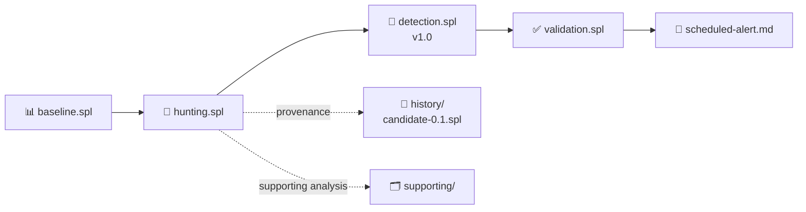

<a id="top"></a>


<div align="center">


 

[🏠 Scenario Home](../README.md) · [🧠 Detection Engineering](../detection-engineering/README.md) · [📊 Dashboard](../dashboard/README.md)

</div>


# 🔎 Scenario 04 — Production SPL Lifecycle



| Artifact | Purpose |
|---|---|
| [`baseline.spl`](baseline.spl) | clean victim DNS profile with Scenario 04 namespace excluded |
| [`hunting.spl`](hunting.spl) | threshold-free parent/child + first-label behavior hunt |
| [`detection.spl`](detection.spl) | frozen Detection v1.0 and analyst/AI evidence contract |
| [`validation.spl`](validation.spl) | reusable validation using the same frozen logic |
| [`scheduled-alert.md`](scheduled-alert.md) | exact production schedule and timing rationale |
| [`history/candidate-0.1.spl`](history/candidate-0.1.spl) | clearly marked development artifact |
| [`supporting/`](supporting/) | resolver fields, ingestion timing, baseline, drilldown and AI-return engineering searches |

## 🧠 Detection v1.0

```text
unique_child_labels >= 5
AND long_label_count >= 5
AND max_first_label_length > 16
```

These values came from Scenario 04 baseline and controlled testing; they were not copied from another scenario.

> **Production boundary:** the official SOC and IR searches are kept separately under `soc/spl/` and `ir/spl/` so building the detector is never confused with investigating the incident.


<div align="center">

[🏠 Scenario Home](../README.md) · [🧠 Detection Workspace](../detection-engineering/README.md) · [📊 Dashboard](../dashboard/README.md)

<br/>

**Readable SPL is part of the evidence chain.**

[⬆ Back to top](#top)

</div>


